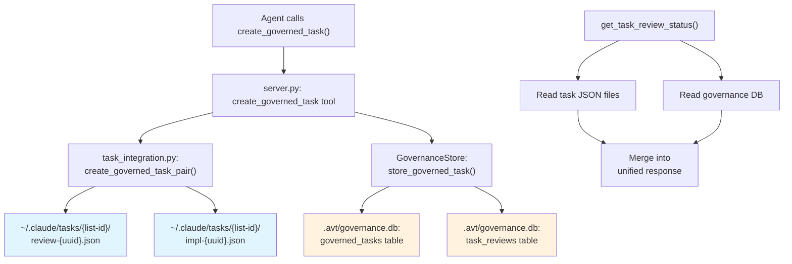
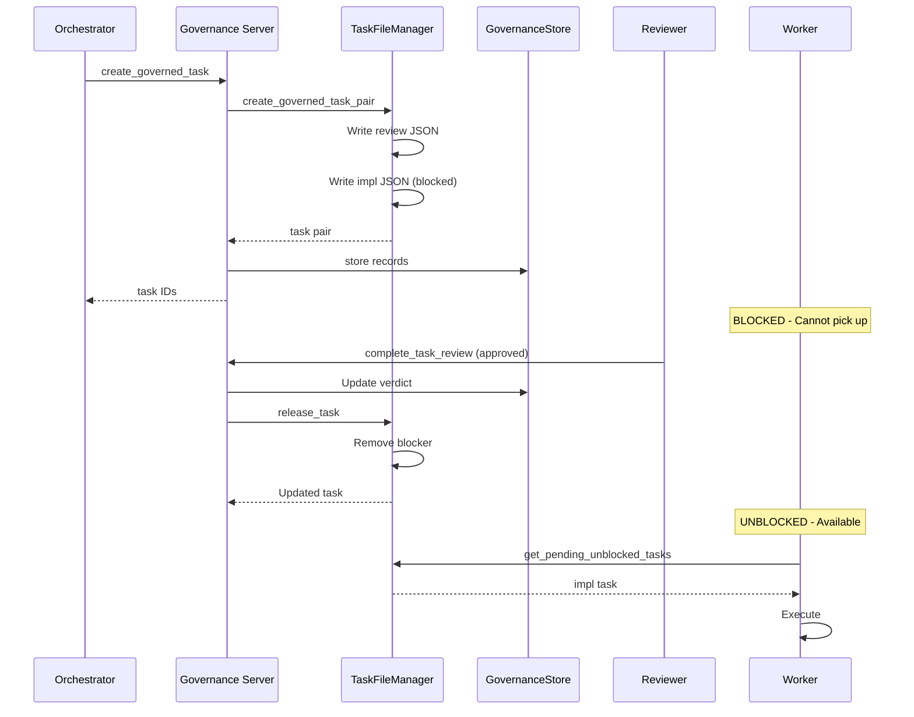
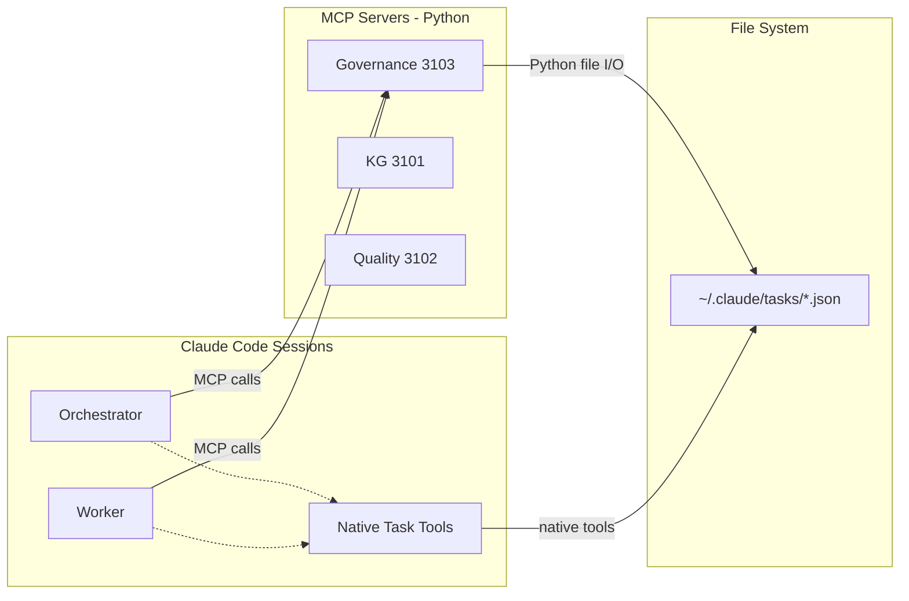
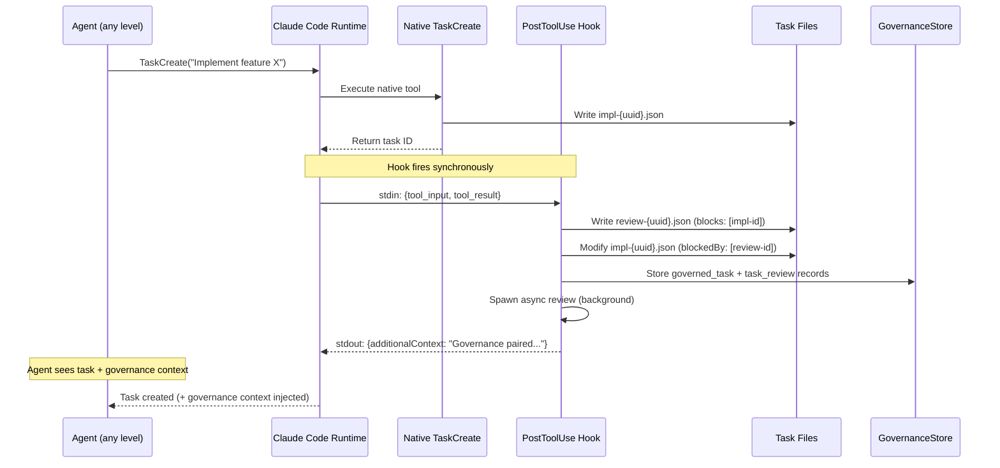

# Task System Integration Analysis

## How the Governance Layer Interacts with Claude Code's Native Task Infrastructure

**Analysis Date**: 2026-02-06
**Status**: Decision Pending
**Scope**: Governance MCP Server + Claude Code Task System interplay

This document examines how the project's governance layer creates and manages tasks, how that relates to Claude Code's native Task System, and what alternatives exist. It is grounded in actual code paths and architecture documentation. It presents options for decision; it does not conclude with a single recommendation.

---

## 1. What We Are Trying to Do

The system's core principle is **"Intercept Early, Redirect Early."** Every implementation task must be reviewed against vision standards, architecture patterns, and institutional memory *before* any agent can execute it. The mechanism for this is the **"blocked from birth" invariant**: when a task is created, it is simultaneously paired with a governance review blocker. The implementation task literally cannot be picked up until the review completes and returns an "approved" verdict.

This requires two distinct concerns:

- **Infrastructure**: Where are tasks stored? How do dependencies work? How do multiple agents see the same task state?
- **Policy**: Should this task proceed? What reviews are required? What standards apply?

The architecture (Section 8.6 of the v2 architecture document) explicitly separates these into two layers:

```
Task List (infrastructure)          Governance (policy)
---------------------               --------------------
DAG dependencies                    Whether a task should proceed
File locking                        What reviews are required
Cross-session persistence           What standards apply
Automatic unblocking                Verdict logic (approved/blocked/needs_human_review)
```

**Source**: `docs/arch-v2-sections-07-08.md` lines 563-631, `docs/arch-v2-sections-01-03.md` lines 442-462

---

## 2. Claude Code's Native Task System

In late January 2026, Claude Code shipped a native Task System (v2.1.16+) that replaced the older TodoWrite tool. This is not a minor enhancement; it is a fundamentally different system:

| Capability | TodoWrite (legacy) | Native Task System |
|------------|-------------------|-------------------|
| Storage | In-memory, session-scoped | JSON files at `~/.claude/tasks/<list-id>/` |
| Dependencies | None (flat list) | DAG with `blockedBy`/`blocks` |
| Cross-session | No | Yes, via `CLAUDE_CODE_TASK_LIST_ID` |
| Native tools | `TodoWrite` | `TaskCreate`, `TaskUpdate`, `TaskList`, `TaskGet` |
| Terminal UI | Status line only | `Ctrl+T` toggle with up to 10 tasks |
| Hooks | None | `TaskCompleted`, `TeammateIdle`, `plan_approval_request` |

The native system supports specifying `blockedBy` at creation time via `TaskCreate`, meaning a task can be born blocked without a separate "add blocker" step. Tasks are stored as individual JSON files, one per task, with `fcntl`-based file locking for concurrency safety. The `CLAUDE_CODE_TASK_LIST_ID` environment variable causes all sessions to share the same task directory.

**Key point**: The native tools (`TaskCreate`, `TaskUpdate`, etc.) are available only to agents running *inside* Claude Code sessions. They are not callable from external processes.

---

## 3. How It Actually Works in Code

When an agent (typically the orchestrator) needs to create a governed task, the actual code path is:

**Step 1**: Agent calls the `create_governed_task()` MCP tool on the Governance server (port 3103).

**Step 2**: The tool handler in `server.py` orchestrates a dual-write:

```python
# server.py lines 368-394
# (a) Write task files to ~/.claude/tasks/<list-id>/
review_task, impl_task = create_governed_task_pair(
    subject=subject, description=description,
    context=context, review_type=review_type,
)

# (b) Record in governance SQLite database
store.store_governed_task(governed_task)
store.store_task_review(task_review)
```

**Step 3**: Inside `create_governed_task_pair()` (in `task_integration.py` lines 211-273), two JSON files are written:

1. The **review task** is written first, with `blocks: [impl_id]`
2. The **implementation task** is written second, with `blockedBy: [review_id]`

Each file write acquires an exclusive lock via `fcntl.flock()` before writing.

**Step 4**: Before writing, `to_claude_dict()` strips governance-specific metadata:

```python
# task_integration.py lines 52-65
def to_claude_dict(self) -> dict:
    return {
        "id": self.id,
        "subject": self.subject,
        "description": self.description,
        "status": self.status,
        "owner": self.owner,
        "activeForm": self.activeForm or f"Working on {self.subject}",
        "blockedBy": self.blockedBy,
        "blocks": self.blocks,
        "createdAt": self.createdAt,
        "updatedAt": self.updatedAt,
    }
```

The `governance_metadata` field (containing review type, context, timestamps) is deliberately excluded. It lives in the `Task` dataclass for in-memory use and in the SQLite database for persistence, but it does not appear in the JSON files.

**Step 5**: When a review completes, `release_task()` (lines 331-384) either removes the blocker (if approved) or appends guidance to the description (if blocked).

### Diagram 1: Dual-Write Architecture



The JSON files (blue) hold task state visible to Claude Code. The SQLite records (orange) hold governance policy data: review type, verdict, findings, standards verified. Status queries merge both sources.

**Source files**: `mcp-servers/governance/collab_governance/task_integration.py`, `mcp-servers/governance/collab_governance/server.py` lines 330-405, `mcp-servers/governance/collab_governance/store.py` lines 77-109

---

## 4. The Governed Task Lifecycle

The full lifecycle from creation through execution:

1. **Creation**: `create_governed_task()` atomically creates a review task + implementation task. The implementation task is born with `blockedBy: [review_id]`.

2. **Blocking**: The implementation task cannot be picked up. `get_pending_unblocked_tasks()` (line 201) returns only tasks where `status == "pending"`, `blockedBy` is empty, and `owner` is null.

3. **Additional reviews**: `add_review_blocker()` can stack additional blockers. A task can have multiple simultaneous review blockers (governance + security + architecture). ALL must clear before the task unblocks.

4. **Review**: The governance reviewer (manual or automated via `claude --print`) evaluates the task against vision standards and architecture patterns from the Knowledge Graph. Returns a verdict: approved, blocked, or needs_human_review.

5. **Release**: `complete_task_review()` calls `release_task()`, which removes the review from the implementation task's `blockedBy` array (if approved) or keeps it blocked with guidance (if blocked/needs_human_review).

6. **Execution**: Once `blockedBy` is empty, the task appears in `get_pending_unblocked_tasks()` and a worker can claim it.

### Diagram 2: Governed Task Lifecycle



The multi-blocker variant (tested in `e2e/scenarios/s08_multi_blocker_task.py`) works identically, except `blockedBy` contains multiple review IDs. Each `complete_task_review("approved")` removes one entry. The task only unblocks when the array is empty.

**Source files**: `e2e/scenarios/s03_governed_task_lifecycle.py`, `e2e/scenarios/s08_multi_blocker_task.py`

---

## 5. Why File-Level Integration (Not Native Tools)

The governance layer writes JSON files directly to `~/.claude/tasks/` rather than calling Claude Code's native `TaskCreate`/`TaskUpdate` tools. This is not primarily a design preference. It is a **fundamental architectural constraint**.

### The Process Boundary Problem

The governance MCP server is a standalone Python process (`uv run python -m collab_governance.server`). It runs outside of any Claude Code session. Claude Code's native tools (`TaskCreate`, `TaskUpdate`, `TaskList`, `TaskGet`) are only available to agents running *inside* Claude Code sessions, as part of the Claude Code tool system.

**An MCP server cannot call Claude Code's native tools.** MCP servers provide tools *to* Claude Code; they do not consume tools *from* Claude Code. The relationship is one-directional.

### The File System as Shared Communication Channel

Since the governance server cannot call native task tools, it uses the one resource both worlds share: the file system. By writing JSON files to `~/.claude/tasks/<list-id>/` in a format compatible with Claude Code's native expectations, the governance layer achieves interoperability without API access.

### Diagram 3: Process Boundary



Both Claude Code's native tools and the governance server's `TaskFileManager` read and write the same directory. The file system is the integration point.

### Additional Rationale

Beyond the process boundary constraint, the current approach offers:

- **Atomicity control**: `fcntl.flock()` gives deterministic locking the governance layer fully controls. The "blocked from birth" invariant depends on writing the review task before the implementation task, in that exact order.
- **Metadata separation**: `to_claude_dict()` keeps JSON files clean for Claude Code consumption. Governance metadata (review type, context, timestamps) lives in SQLite.
- **Isolation from native changes**: If Claude Code's task file format evolves, only `task_integration.py` needs updating. Governance policy logic remains untouched.

### The Format Compatibility Question

The JSON schema produced by `to_claude_dict()` matches the documented native format. However, this has never been validated against actual `TaskCreate` output on this machine. The `~/.claude/tasks/` directory does not exist yet because the system has not been exercised end-to-end outside of E2E tests (which use isolated temp directories).

**Source files**: `mcp-servers/governance/collab_governance/task_integration.py` lines 22-27 (`_get_task_dir`), lines 100-114 (`create_task` with locking), lines 52-65 (`to_claude_dict`)

---

## 6. What Works Well About This

The current architecture has several concrete strengths:

- **The "blocked from birth" invariant is guaranteed.** Because the governance server controls both file writes, the implementation task is never visible without its blocker. There is no window where it could be picked up prematurely.

- **No dependency on tool availability.** The governance server works regardless of whether the Claude Code session has the native task tools loaded or whether tool search has pruned them.

- **Clean policy/infrastructure separation.** Governance rules can evolve (new review types, different verdict logic, additional checks) without touching the file I/O layer. Conversely, if the task file format changes, only `task_integration.py` adapts.

- **E2E tested.** The governed task lifecycle is validated across 172+ structural assertions. Scenario `s03` tests the full create-block-release cycle (27 assertions). Scenario `s08` tests 3-blocker stacking with sequential release (19 assertions).

- **Extension-ready.** The `_queue_governance_review()` call in `server.py` (line 397) is designed for async processing, positioning the system for automated review pipelines.

---

## 7. Implemented Solution: PostToolUse Hook-Based Interception

**Status**: Implemented and tested (2026-02-06)

The fundamental problem with the original architecture (Section 3) is that enforcement depends on LLMs voluntarily calling `create_governed_task()` instead of native `TaskCreate`. LLMs cannot reliably follow instructions; given enough tasks, some will inevitably use the native tool directly, creating ungoverned tasks that bypass the "blocked from birth" invariant.

The solution: a **PostToolUse hook** that fires synchronously after every `TaskCreate` call, transparently creating the governance pair. Enforcement is now event-driven and deterministic, not instruction-based.

### How It Works

```
Agent calls TaskCreate("Implement auth service")
    |
    v
Native TaskCreate runs normally
    |  --> writes impl task JSON to ~/.claude/tasks/
    |  --> returns task ID to Claude
    |
    v
PostToolUse hook fires (SYNCHRONOUS -- Claude waits)
    |
    |  1. Read hook input (stdin JSON with tool_input + tool_result)
    |  2. Extract the newly created task's ID and details
    |  3. Generate review task ID: review-{uuid}
    |  4. Write review task JSON file (with blocks: [impl-id])
    |  5. Modify impl task JSON file (add blockedBy: [review-id])
    |  6. Insert governance records into .avt/governance.db
    |  7. Return additionalContext to Claude
    |
    v
Claude sees: task created + "Governance review auto-created: review-abc123"
    |
    v
Task is governed. Cannot be picked up until review completes.
```

### Diagram 4: Hook-Based Interception Flow



### Key Properties

- **Deterministic**: The hook fires for every `TaskCreate`, every agent, every subagent. No instruction-following required.
- **Non-invasive**: Agents use `TaskCreate` naturally. The hook adds governance transparently.
- **Fast**: Average interception time is 1.1ms per task (measured across 50 sequential tasks). Concurrent interception averages 2.4ms per task across 8 threads.
- **Async review**: The hook creates the governance pair synchronously (~1ms), then spawns the automated review as a background process. The agent is not blocked waiting for review completion.

### Loop Prevention

Review tasks must not trigger another review (infinite loop). The hook detects and skips review tasks via:
- Subject prefix: `[GOVERNANCE]`, `[REVIEW]`, `[SECURITY]`, `[ARCHITECTURE]`
- Task ID prefix: `review-`
- Presence of `blocks:` array (review tasks block implementation tasks)

### Configuration

The hook is configured in `.claude/settings.json`:

```json
{
  "hooks": {
    "PostToolUse": [
      {
        "matcher": "TaskCreate",
        "hooks": [
          {
            "type": "command",
            "command": "uv run --directory ... python .../governance-task-intercept.py",
            "timeout": 15
          }
        ]
      }
    ]
  }
}
```

### Scale Test Results

The pipeline was stress-tested with 70 tasks (50 sequential + 20 concurrent) across 4 phases:

| Phase | Tasks | Assertions | Avg Time | Result |
|-------|-------|------------|----------|--------|
| Rapid-fire (50 sequential) | 50 impl + 50 review | 8 | 1.1ms/task | 100% intercepted |
| Concurrent (20 in 8 threads) | 20 impl + 20 review | 8 | 2.4ms/task | 0 errors, 0 duplicates |
| Release pipeline (50 approved) | 50 released | 5 | 0.3ms/task | 100% unblocked |
| Cross-pair integrity | 140 files checked | 3 | -- | 0 orphans, 100% correct |

Total: 221 assertions across 13 scenarios, zero failures.

### What This Changes Architecturally

**Before**: Agents must voluntarily call `create_governed_task()`. Enforcement is by instruction (unreliable).

**After**: Agents use native `TaskCreate` naturally. The PostToolUse hook transparently creates the governance pair. Enforcement is event-driven (deterministic).

The `create_governed_task()` MCP tool still exists as an optional path for agents that want explicit control over review type, context, or multi-blocker scenarios. Both paths coexist; the hook is the primary enforcement mechanism.

### Source Files

| File | Role |
|------|------|
| `scripts/hooks/governance-task-intercept.py` | The PostToolUse hook script (322 lines) |
| `scripts/hooks/_run-governance-review.sh` | Async review runner spawned by the hook (205 lines) |
| `.claude/settings.json` | Hook configuration (PostToolUse matcher on TaskCreate) |
| `e2e/scenarios/s11_hook_based_governance.py` | E2E test: hook logic (25 assertions) |
| `e2e/scenarios/s13_hook_pipeline_at_scale.py` | E2E test: scale + concurrency (24 assertions) |

### Empirically Verified (2026-02-07)

These have been verified via live Claude Code sessions across 3 test levels:

1. **Hook inheritance**: YES. Subagents spawned via the Task tool DO inherit project PostToolUse hooks. Verified in Level 3 test: main agent created 10 tasks, subagent created 3 more, all 13 were intercepted by the hook. This confirms full coverage across the agent hierarchy.
2. **PostToolUse tool_result schema**: TaskCreate returns an **empty string**. The `tool_result` field contains no task ID or metadata. The hook must discover the task ID by scanning the task directory for a subject match (`_discover_task_id` function).
3. **Hookable tool name**: The name is exactly `"TaskCreate"`. Confirmed via hook log: `PostToolUse fired for tool: TaskCreate`.
4. **Concurrent hook execution**: Not yet stress-tested with truly simultaneous creation, but Level 3's rapid sequential creation (13 tasks in ~6 seconds) showed no races or corruption. File locking via `fcntl.flock()` appears sufficient.
5. **Environment requirements**: Both `CLAUDE_CODE_ENABLE_TASKS="true"` AND `CLAUDE_CODE_TASK_LIST_ID="<name>"` must be set. Without these, TaskCreate is not available (falls back to legacy TodoWrite). When enabled, TodoWrite disappears from the tool list.
6. **Native task file naming**: Sequential integers (`1.json`, `2.json`, ...), not the `impl-{uuid}.json` format used by the governance MCP server's `TaskFileManager`.
7. **CLAUDE.md loads in `-p` mode**: Hooks and project instructions are active in headless (`--print`) mode when running from the project directory.

---

## 8. Historical Alternatives (Superseded)

The following alternatives were considered before the hook-based approach was implemented. They are preserved for reference.

### Alternative A: Go More Native (Orchestrator-Mediated)

Instead of having the governance MCP server write task files directly, restructure the flow so the agent (which IS inside a Claude Code session) handles file creation via native tools, while the governance server only handles policy.

**How it would work**:

1. Agent calls `create_governed_task()` on the governance server
2. Governance server evaluates policy, creates SQLite records, and returns a **task specification** (the two task definitions with IDs, subjects, blockedBy, etc.) but does NOT write any files
3. The agent/orchestrator uses native `TaskCreate` to create both tasks, passing the `blockedBy` array at creation time
4. The governance server only manages the policy side (SQLite records, verdicts, findings)

| Aspect | Assessment |
|--------|-----------|
| Benefit | True native integration; guaranteed format compatibility; `Ctrl+T` display confirmed working; leverages native DAG auto-unblocking |
| Risk | Splits the atomic operation across two actors (governance server returns spec, agent writes files). If the agent fails between creating the review task and the impl task, state becomes inconsistent |
| Mitigation | The governance server could return both task specs in a single response; the orchestrator protocol would mandate creating both before proceeding |
| Migration cost | Moderate: refactor `task_integration.py` into a "specification builder"; update orchestrator protocol in `CLAUDE.md`; update worker agent definition; update E2E tests |
| Key question | Does `TaskCreate` support `blockedBy` and `blocks` at creation time? Research indicates yes, but should be verified on this machine |

### Alternative B: Validate-on-Write (Keep Current + Add Verification)

Keep the current architecture intact but add a format validation step that catches drift between what `TaskFileManager` writes and what Claude Code's native system expects.

**How it would work**:

1. On governance server startup, create a "canary task" using `TaskFileManager`
2. If the native task system is accessible (via a subprocess call to `claude` CLI or similar), also create a canary via native tools
3. Compare the two JSON outputs field-by-field
4. Log warnings or fail-fast if the formats diverge
5. Alternatively, on first real task creation, read back the written file and validate its structure against a known-good schema

| Aspect | Assessment |
|--------|-----------|
| Benefit | Catches format drift early; minimal architecture change; current guarantees preserved |
| Risk | Validation requires access to the native tool output, which may not be available from the Python process; adds startup complexity |
| Migration cost | Low: add a `validate_format()` function to `TaskFileManager`; update E2E tests to include one real-path integration test |
| Key question | Can the Python process invoke `claude --print` or similar to get native task output for comparison? |

---

## 9. Open Questions

With the hook-based approach implemented, some original questions are resolved and new ones emerge:

### Resolved

- **Should the orchestrator protocol change to mediate task creation?** No. The hook-based approach is superior: agents use native `TaskCreate`, the hook adds governance transparently. No protocol change needed.
- **What happens when both the governance server and a native Claude Code tool write to the same task file?** The hook modifies the file *immediately* after native creation (synchronously). There is no window for conflict during the initial creation. For subsequent updates, `TaskUpdate` could overwrite `blockedBy`, but this is acceptable because the governance DB is the source of truth for review status, and the review task file still exists as a separate artifact.

### Resolved by Live Testing (2026-02-07)

- **Do subagents inherit PostToolUse hooks?** YES. Confirmed in Level 3 test. Subagent TaskCreate calls fire the parent's hooks.
- **Is `Ctrl+T` task display a requirement?** The hook writes task files in the native sequential format (`1.json`, `2.json`). Hook-created review files use `review-{uuid}.json`. Both coexist in the same task directory. `Ctrl+T` compatibility not yet tested but format alignment is confirmed.
- **Do we need integration tests against the real `~/.claude/tasks/` path?** Partially addressed. The live test script (`scripts/hooks/test-hook-live.sh`) writes to real `~/.claude/tasks/<list-id>/` directories. Each test run uses a unique list ID to prevent collisions.

### Still Open

- **Should we add a format validation canary on startup?** Low cost, catches drift early. Now that the hook is confirmed working, this is a nice-to-have.
- **Concurrent hook execution under load**: Level 3 tested 13 rapid sequential creations without issues, but true parallel creation from multiple simultaneous subagents needs testing.

---

## Appendix: Key Source Files

| File | Role in This Analysis |
|------|-----------------------|
| `scripts/hooks/governance-task-intercept.py` | **PostToolUse hook**: intercepts TaskCreate, creates governance pair |
| `scripts/hooks/_run-governance-review.sh` | Async review runner spawned by the hook |
| `.claude/settings.json` | Hook configuration (PostToolUse matcher on TaskCreate) |
| `mcp-servers/governance/collab_governance/task_integration.py` | The bridge module: `TaskFileManager`, `create_governed_task_pair()`, `release_task()` |
| `mcp-servers/governance/collab_governance/server.py` | MCP tool handlers orchestrating dual-write |
| `mcp-servers/governance/collab_governance/store.py` | SQLite persistence: `governed_tasks` and `task_reviews` tables |
| `docs/arch-v2-sections-07-08.md` (Section 8.6) | Architecture: Task List + Governance Layering |
| `docs/arch-v2-sections-01-03.md` (Section 3.6) | Architecture: Native Task List description |
| `docs/arch-v2-sections-12-15.md` (Section 12.1) | Data flow: Task Execution Flow diagram |
| `e2e/scenarios/s03_governed_task_lifecycle.py` | E2E test: full lifecycle (26 assertions) |
| `e2e/scenarios/s08_multi_blocker_task.py` | E2E test: multi-blocker stacking (18 assertions) |
| `e2e/scenarios/s11_hook_based_governance.py` | E2E test: hook-based governance (25 assertions) |
| `e2e/scenarios/s13_hook_pipeline_at_scale.py` | E2E test: scale + concurrency (24 assertions) |
| `.claude/agents/worker.md` | Worker protocol: "Use TaskCreate normally" (hook handles governance) |
| `CLAUDE.md` | Orchestrator instructions: Hook-Based Task Governance Protocol |
