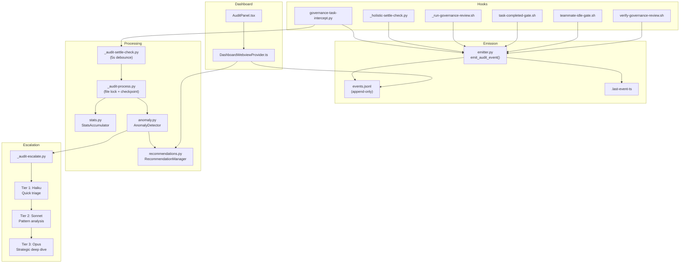

# Audit Agent

## Type

component

## Description

Passive system observer that watches all AVT activity through hook-piggybacked event emission, detects anomalies via threshold-based checks, and produces actionable recommendations through a tiered LLM escalation chain (Haiku triage, Sonnet analysis, Opus deep dive). Uses a "fan belt" architecture: powered by the system's own hook activity, dormant when idle. No daemon, no long-running process.

## Usage

Enabled via `settings.audit.enabled: true` in `.avt/project-config.json`. Once enabled, existing hooks automatically emit audit events. Processing is triggered by settle detection after batches of activity.

## Internal Structure



## Event Types

| Category | Events | Source Hook |
|----------|--------|------------|
| **Governance** | `governance.task_pair_created`, `governance.holistic_review_completed`, `governance.holistic_review_skipped`, `governance.individual_review_completed`, `governance.plan_exit_attempted` | governance-task-intercept, _holistic-settle-check, _run-governance-review, verify-governance-review |
| **Task** | `task.completion_attempted` | task-completed-gate |
| **Agent** | `agent.idle_blocked` | teammate-idle-gate |

## Processing Pipeline

1. **Event emission** (~0.5ms): Hooks call `emit_audit_event()`, which appends to `events.jsonl` and updates `.last-event-ts`. Wrapped in try/except pass (TAP guarantee).
2. **Settle detection** (5s): `governance-task-intercept.py` spawns `_audit-settle-check.py` as a detached subprocess. It sleeps 5s, checks if newer events arrived, and spawns the processor only if quiet.
3. **Processing** (~5ms typical): `_audit-process.py` acquires a file lock, reads events since the last checkpoint, updates rolling statistics in SQLite, and runs anomaly detection.
4. **Anomaly detection**: Five threshold checks (block rate, gate block rate, idle blocks, reinforcement skip rate, event rate spike). Pure Python arithmetic, no LLM.
5. **Recommendation creation**: Anomalies produce recommendations (deduplicated by type, TTL-based expiry, JSON-file lifecycle).
6. **Escalation** (only on warning+ anomalies): Three tiers of detached subprocesses, each spawning the next only if warranted.

## Anomaly Checks

| Check | Threshold | Severity |
|-------|-----------|----------|
| High governance block rate | > 50% per session | warning |
| High gate block rate | > 50% with min 3 gates | warning |
| Repeated idle blocks | 3+ in one batch | info |
| High reinforcement skip rate | > 70% with min 3 events | warning |
| Event rate spike | > 3x rolling baseline | info |

## Observation Directives

Five editable directives in `directives.json`:
- `setting-correlation`: Detect setting value / outcome correlations
- `prompt-effectiveness`: Detect when prompts are not producing intended outcomes
- `range-adequacy`: Detect when setting ranges are too narrow or wide
- `governance-health`: Monitor overall governance pipeline health
- `coverage-gaps`: Detect expected events that never fire

## Recommendation Lifecycle

```
active -> stale     (TTL expired, auto-pruned)
active -> dismissed (user dismisses with reason)
active -> superseded (newer recommendation covers same area)
active -> resolved  (condition addressed)
```

Evidence count increments on re-detection; TTL resets each time.

## Storage

All under `.avt/audit/` (gitignored):

| File | Format | Purpose |
|------|--------|---------|
| `events.jsonl` | JSONL (append-only) | Source of truth for all audit events |
| `statistics.db` | SQLite (WAL mode) | Rolling aggregates: event_counts, session_summaries, metric_windows, anomalies |
| `recommendations.json` | JSON | Active and historical recommendations |
| `checkpoint.json` | JSON | Last-processed byte offset into events.jsonl |
| `.last-event-ts` | Text (epoch float) | Settle coordination between concurrent checkers |
| `.processor-lock` | File lock (fcntl) | Prevents concurrent processor runs |

## Dependencies

- Python 3.9+ (no external dependencies beyond stdlib)
- Claude CLI (`claude --print`) for escalation tiers
- SQLite3 (stdlib)

## Patterns Used

- Network TAP (passive, non-intrusive observation)
- Fan Belt (driven by existing system activity, dormant when idle)
- Settle/Debounce (same pattern as governance holistic review, but 5s instead of 3s)
- Fire-and-Forget Subprocess (`subprocess.Popen(start_new_session=True)`)
- TAP Guarantee (all audit code wrapped in `try/except: pass`)
- Temp File I/O (for `claude --print` invocations in escalation)
