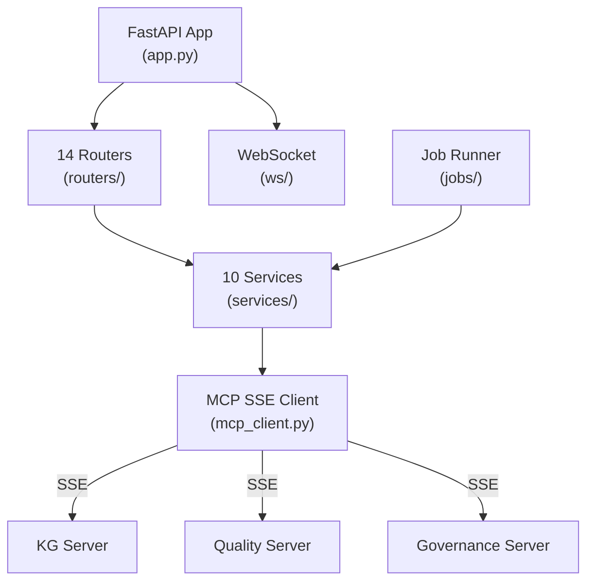

# AVT Gateway

## Type

component

## Description

FastAPI backend providing REST API access to all three MCP servers, WebSocket push notifications, and a job runner for remote/asynchronous operations. Serves as the API layer for the standalone dashboard mode.

## Usage

External clients (React Dashboard in standalone mode) connect via HTTP REST endpoints and WebSocket. The gateway proxies requests to MCP servers using SSE-based MCP connections.

## Internal Structure

## Dependencies

- `fastapi`: Web framework
- `uvicorn`: ASGI server
- SSE client for MCP server communication

## Patterns Used

- SSE-Based MCP Connection (P4)
- Router/Service layering
