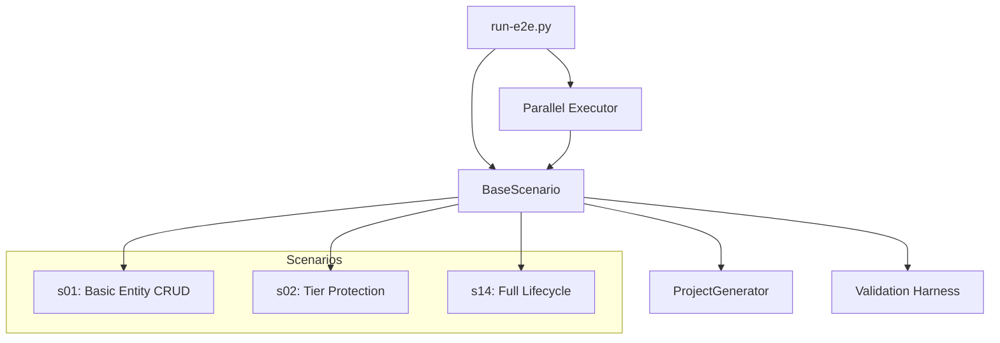

# E2E Test Harness

## Type

component

## Description

End-to-end testing framework with 14 scenarios covering the full governance lifecycle. Each scenario generates a unique project, exercises MCP server interactions, and validates outcomes through domain-agnostic structural assertions. Supports parallel execution via ThreadPoolExecutor.

## Usage

Run via `python e2e/run-e2e.py` or `bash e2e/run-e2e.sh`. Supports `--parallel` flag and scenario filtering.

## Internal Structure

## Dependencies

- pytest (for assertions)
- MCP servers (library mode or HTTP mode)
- ThreadPoolExecutor (parallel execution)

## Patterns Used

- E2E Scenario Pattern (P7)
- Structural assertions (domain-agnostic)
