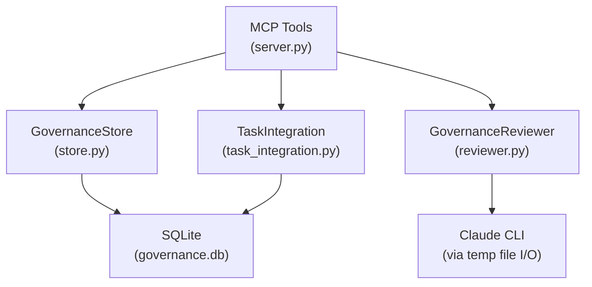

# Governance MCP Server

## Type

component

## Description

Transactional governance checkpoint service for agent decision review. Provides both MCP-based decision review (AI-powered, using PIN methodology) and task integration (governed task lifecycle with automatic review pairing). Uses SQLite for decision and task state persistence.

## Usage

Agents interact via MCP tool calls: `submit_decision`, `submit_plan_for_review`, `submit_completion_review`, `get_decision_history`, `get_governance_status`, `create_governed_task`, `add_review_blocker`, `complete_task_review`, `get_task_review_status`, `get_pending_reviews`, `get_usage_report`.

## Internal Structure

## Dependencies

- `fastmcp`: MCP server framework
- `pydantic`: Data validation
- Claude CLI: For AI-powered governance review (via temp file I/O pattern)

## Patterns Used

- FastMCP Server Pattern (P1)
- Pydantic Models with Field Aliases (P2)
- Temp File I/O for CLI (P3, A11)
- PIN Review Methodology (P8, A12)
