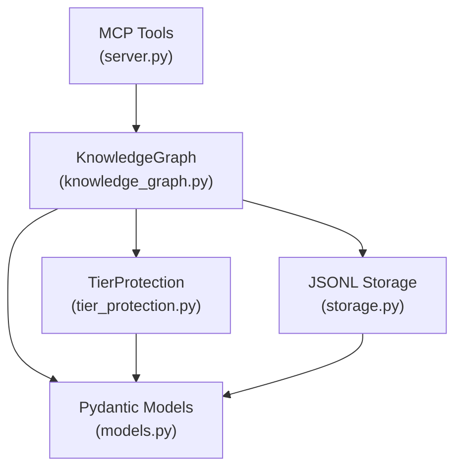

# Knowledge Graph MCP Server

## Type

component

## Description

Persistent institutional memory service providing CRUD operations for entities, relations, and observations. Enforces three-tier protection (vision, architecture, quality) at the storage layer. Uses JSONL file-based persistence with in-memory caching.

## Usage

Agents interact via MCP tool calls: `create_entities`, `create_relations`, `add_observations`, `get_entity`, `search_nodes`, `get_entities_by_tier`, `delete_entity`, `delete_observations`.

## Internal Structure

## Dependencies

- `fastmcp`: MCP server framework
- `pydantic`: Data validation and serialization
- No external database; uses JSONL files

## Patterns Used

- FastMCP Server Pattern (P1)
- Pydantic Models with Field Aliases (P2)
- Three-Tier Protection (A9)
