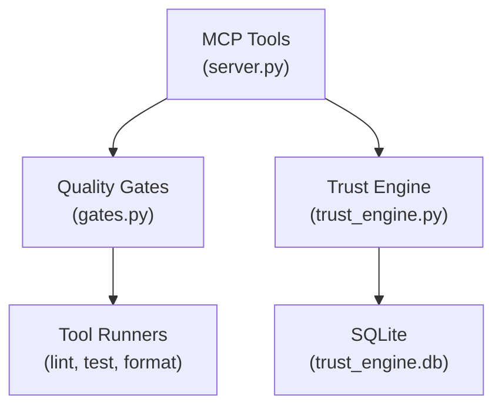

# Quality MCP Server

## Type

component

## Description

Deterministic quality verification service wrapping real tools (compilers, linters, test suites, coverage analyzers). Includes a trust engine that tracks finding dismissals with required justification and identity. Uses SQLite for trust engine persistence.

## Usage

Agents interact via MCP tool calls: `auto_format`, `run_lint`, `run_tests`, `check_coverage`, `check_all_gates`, `validate`, `get_trust_decision`, `record_dismissal`.

## Internal Structure

## Dependencies

- `fastmcp`: MCP server framework
- `pydantic`: Data validation
- External tools: ESLint, Ruff, pytest, Mocha, coverage tools

## Patterns Used

- FastMCP Server Pattern (P1)
- Pydantic Models with Field Aliases (P2)
- Deterministic Verification (V4)
