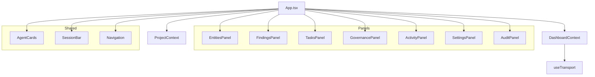

# React Dashboard

## Type

component

## Description

Real-time monitoring dashboard built with React and Tailwind CSS. Operates in dual mode: inside VS Code (using postMessage transport) and standalone in a browser (using HTTP/WebSocket transport via AVT Gateway). Zero component duplication between modes.

## Usage

In VS Code: loaded as a webview panel. Standalone: served by AVT Gateway at the web root.

## Internal Structure

## Dependencies

- React 18
- Tailwind CSS
- Recharts (charting)
- VS Code Webview API (VS Code mode)
- HTTP/WebSocket (standalone mode)

## Patterns Used

- Context Provider Pattern (P5)
- Dual-Mode Transport (A10)
