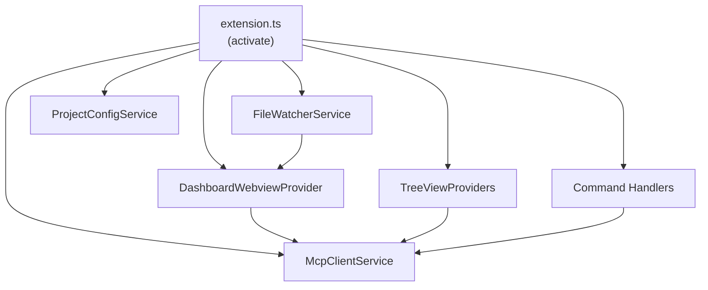

# VS Code Extension

## Type

component

## Description

VS Code extension providing IDE integration for the AVT system. Hosts the React dashboard webview, provides tree view providers for entities, findings, and tasks, wraps MCP server communication, and manages file watchers for real-time updates.

## Usage

Activated automatically when a project with `.avt/` directory is opened. Provides commands, tree views, and the dashboard webview panel.

## Internal Structure

## Dependencies

- VS Code Extension API
- MCP servers (via SSE)

## Patterns Used

- SSE-Based MCP Connection (P4)
- Provider pattern (VS Code tree views)
- Webview communication (postMessage bridge)
