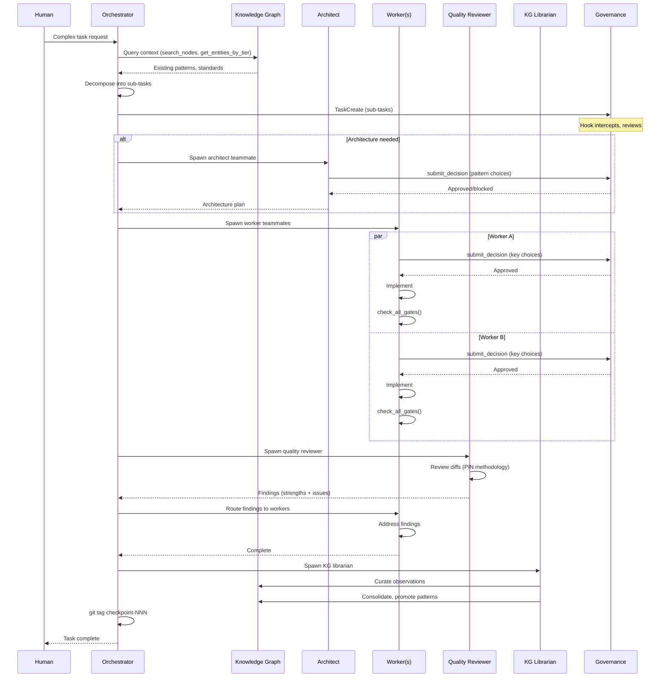

# Agent Orchestration Flow

## Description

Flow showing how the orchestrator decomposes a complex task, spawns specialized agents, and manages the full lifecycle through review and memory curation.

## Sequence Diagram

