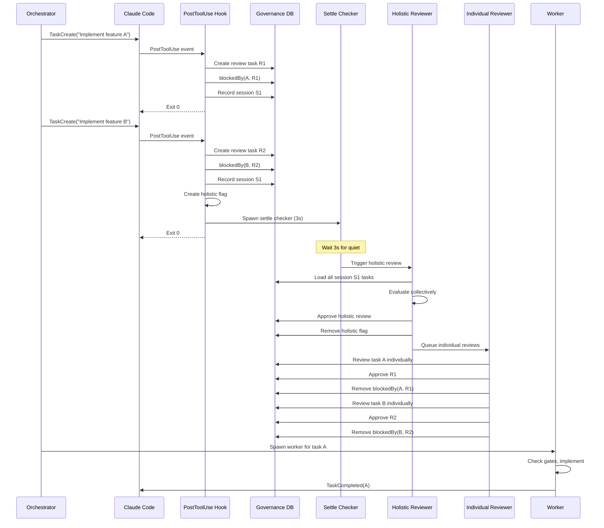

# Task Governance Flow

## Description

End-to-end flow from task creation through governance review to task execution. Shows how the PostToolUse hook, holistic review, and individual review interact.

## Sequence Diagram

