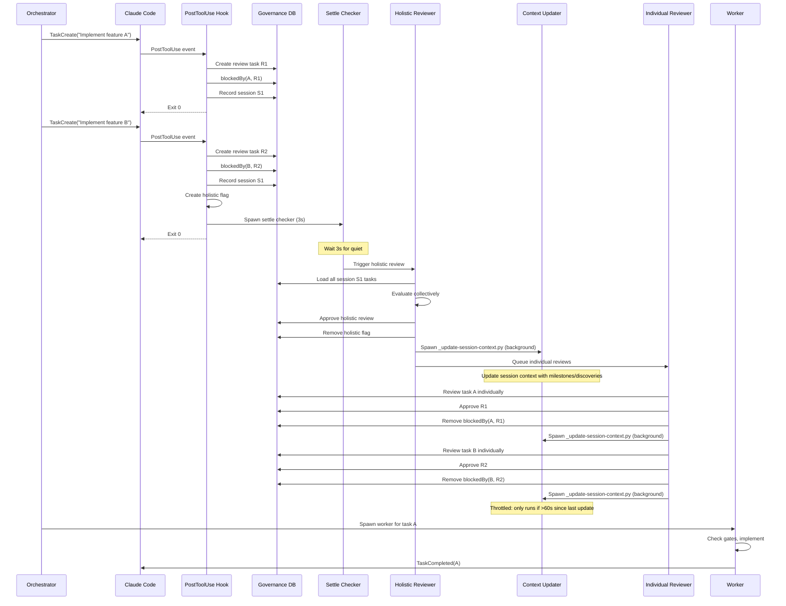

# Task Governance Flow

## Description

End-to-end flow from task creation through governance review to task execution, including context update integration. Shows how the PostToolUse hook, holistic review, individual review, and session context evolution interact.

## Sequence Diagram

## Context Update Integration Points

After governance reviews complete, the session context file (`.avt/.session-context-{session_id}.json`) is updated via `_update-session-context.py`:

1. **After holistic review**: `_holistic-settle-check.py` spawns the context updater to capture collective review findings
2. **After individual review**: `_run-governance-review.sh` spawns the context updater to mark goal progress and add discoveries
3. **Throttling**: Updates run at most once per 60 seconds (configurable via `sessionContextDebounceSeconds`)
4. **Non-blocking**: All context updates run as detached background processes (`start_new_session=True`)
