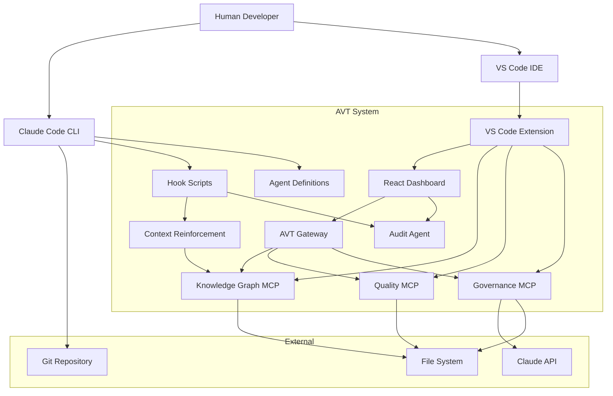
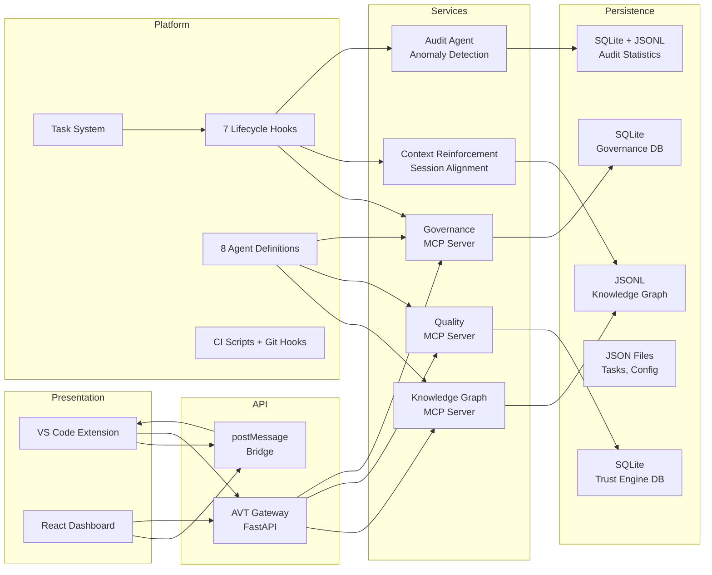

# Architecture Overview

## Project Summary

Agent Vision Team (AVT) is a collaborative intelligence platform that coordinates multiple AI agents for software development. It combines Claude Code's native capabilities (subagents, hooks, git worktrees, model routing) with three custom MCP servers (Knowledge Graph, Quality, Governance), a context reinforcement system that maintains agent alignment across long sessions, and an audit agent that passively monitors system health and produces actionable recommendations via tiered LLM analysis.

## System Context

## Component Map

## Component Inventory

| Component | Responsibility | Language | Path | Key Patterns |
|-----------|---------------|----------|------|-------------|
| VS Code Extension | IDE integration, webview hosting, MCP client wrappers | TypeScript | `extension/src/` | Provider pattern, command registration |
| React Dashboard | Real-time monitoring UI, dual-mode (VS Code + standalone) | React/TSX | `extension/webview-dashboard/src/` | Context providers, dual-mode transport |
| Knowledge Graph MCP | Persistent institutional memory, tier-protected CRUD | Python | `mcp-servers/knowledge-graph/` | FastMCP, JSONL storage, tier protection |
| Quality MCP | Deterministic quality gates, trust engine | Python | `mcp-servers/quality/` | FastMCP, tool wrapping, SQLite |
| Governance MCP | Decision review, governed tasks, AI reviewer | Python | `mcp-servers/governance/` | FastMCP, SQLite, temp file I/O |
| AVT Gateway | REST API, WebSocket push, job runner | Python | `server/avt_gateway/` | FastAPI, SSE MCP client, routers |
| E2E Test Harness | 14 scenarios, 292+ assertions, parallel execution | Python | `e2e/` | BaseScenario, structural assertions |
| Context Reinforcement | Session context distillation, goal tracking, three-layer injection | Python/Bash | `scripts/hooks/` | Background distillation, atomic writes, file locking |
| Audit Agent | Passive system observer: event emission, anomaly detection, tiered LLM escalation, recommendations | Python | `scripts/hooks/audit/` | Hook piggyback, settle/debounce, fire-and-forget subprocess, TAP guarantee |
| Hook Scripts | Platform-level governance verification + context drift prevention (7 hooks) | Bash/Python | `scripts/hooks/` | JSON stdin/stdout, fast-path, exit codes, additionalContext injection |
| CI Scripts | Unified quality pipeline (lint, typecheck, build, test, coverage) | Bash | `scripts/ci/` | Same scripts locally and in CI |
| GitHub Actions | CI pipeline on every push | YAML | `.github/workflows/ci.yml` | Parallel jobs, matrix strategy, xvfb |
| Git Hooks | Pre-commit (lint staged), pre-push (full pipeline) | Bash | `.husky/` | Husky v9, lint-staged, clear error reporting |

## Key Architectural Decisions

1. **MCP over custom API**: Using Model Context Protocol for all agent-service communication rather than REST or GraphQL
2. **Three-tier protection**: Vision/Architecture/Quality hierarchy enforced at the storage layer, not the API layer
3. **Hook-based governance**: Using Claude Code lifecycle hooks for automatic governance rather than requiring explicit agent cooperation
4. **Dual-mode transport**: Same React dashboard runs in VS Code (postMessage) and standalone (HTTP/WebSocket) with zero component duplication
5. **Temp file I/O**: Claude CLI invocations use temp files instead of CLI args or pipes to avoid buffer limits
6. **Session-scoped holistic review**: Groups of tasks reviewed collectively before any work begins, using timing-based settle detection
7. **Three-layer context reinforcement**: Session context (distilled goals/discoveries), static router (KG-derived vision/architecture), and post-compaction recovery. Background AI calls via `claude --print --model haiku`; synchronous hooks only read files
8. **Scripts-first CI/CD**: All quality checks run via bash scripts in `scripts/ci/`; git hooks and GitHub Actions both call the same scripts, ensuring local and CI behavior are identical
9. **Hook-piggybacked audit**: Passive audit agent driven by existing hook activity (no daemon); tiered LLM escalation (Haiku triage, Sonnet analysis, Opus deep dive) triggered only by detected anomalies
