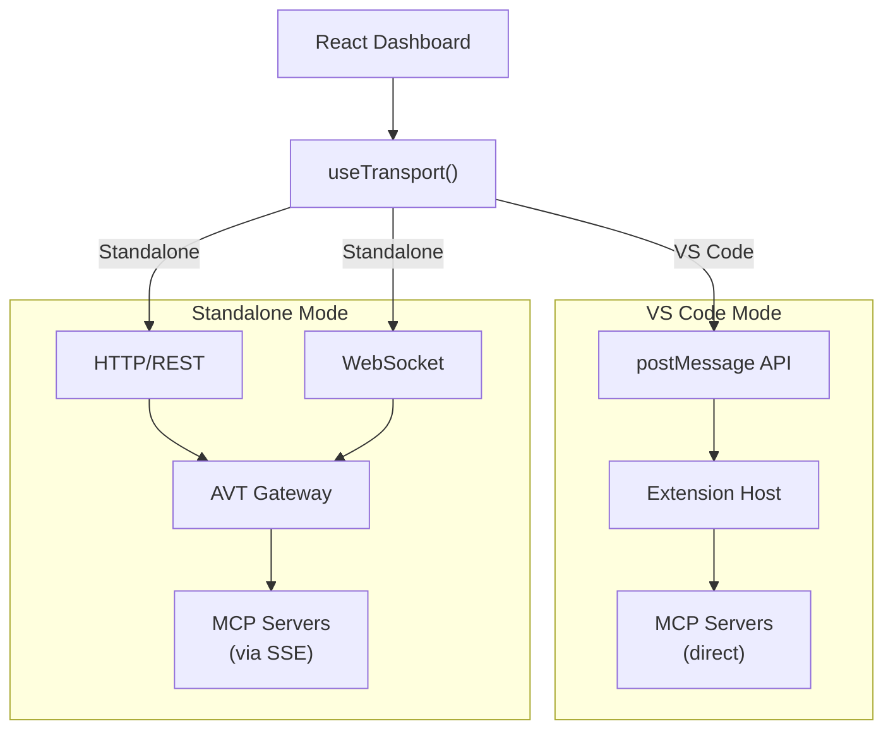

# Dual-Mode Transport

## Type

pattern

## Description

The React Dashboard operates in two modes with zero component duplication. In VS Code mode, it communicates via the webview `postMessage` API. In standalone mode, it communicates via HTTP REST and WebSocket through the AVT Gateway. The `useTransport` hook abstracts this difference.

## Structure

## Key Properties

- Environment detection is automatic (checks for VS Code API availability)
- Same React components in both modes
- Transport abstraction in `useTransport.ts`
- VS Code mode: synchronous postMessage round-trips
- Standalone mode: async HTTP with WebSocket push for real-time updates
