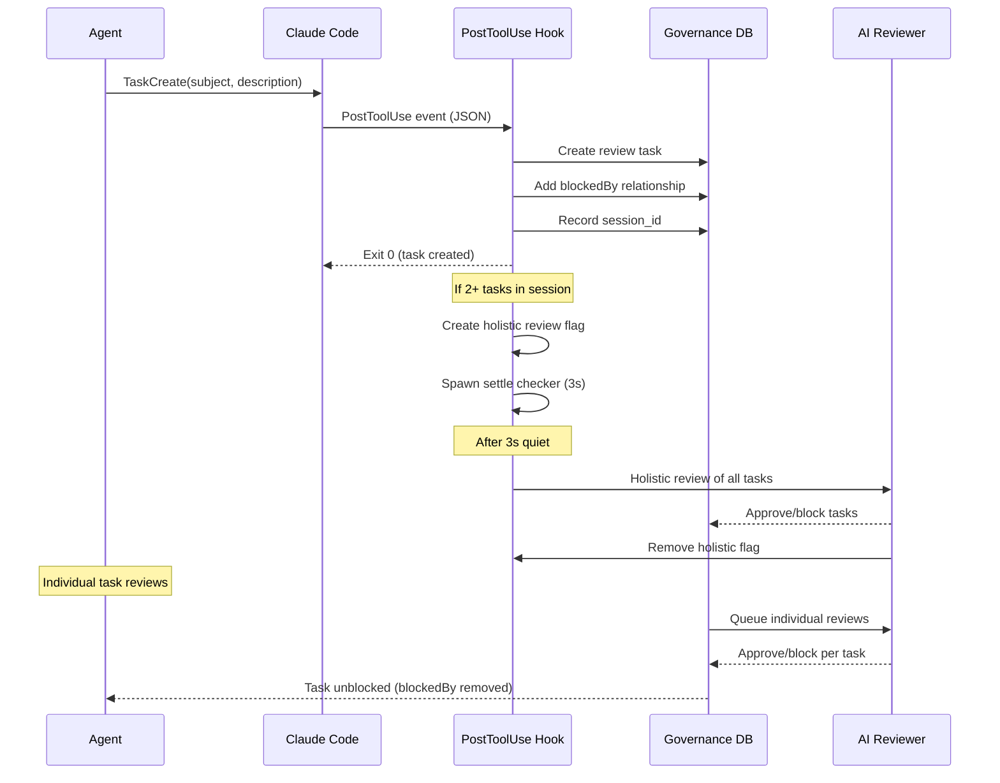

# Governed Task Lifecycle

## Type

pattern

## Description

Every task created via TaskCreate is automatically paired with a governance review through the PostToolUse hook. The review task is linked via `blockedBy`, preventing the implementation task from starting until governance approval. For groups of tasks (2+), a holistic review evaluates them collectively using timing-based settle detection.

## Lifecycle

## Key Properties

- Automatic (no explicit agent cooperation needed)
- Session-scoped (tasks grouped by session_id)
- Settle detection (3s debounce, last checker triggers)
- Stale flag recovery (5-minute auto-clear)
- Single tasks skip holistic review (MIN_TASKS_FOR_REVIEW = 2)
