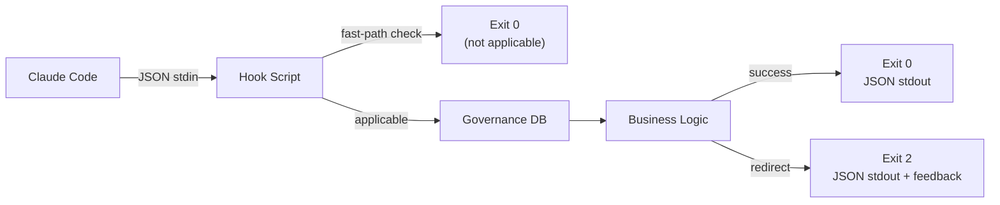

# Hook Verification Pattern

## Type

pattern

## Description

All five lifecycle hooks follow a consistent verification pattern: read JSON from stdin (Claude Code hook protocol), perform a fast-path exit check (~1ms when not applicable), interact with the governance SQLite database for state management, write JSON to stdout with `hookSpecificOutput.additionalContext`, and use exit code semantics (0=success, 2=redirect with feedback).

## Structure

## Instances

| Hook | Event | Script | Purpose |
|------|-------|--------|---------|
| PostToolUse:TaskCreate | TaskCreate | `governance-task-intercept.py` | Pair tasks with governance review |
| PreToolUse:Write,Edit,Bash,Task | Mutation tools | `holistic-review-gate.sh` | Block during holistic review |
| PreToolUse:ExitPlanMode | ExitPlanMode | `verify-governance-review.sh` | Verify plans before presentation |
| TeammateIdle | Teammate idle | `teammate-idle-gate.sh` | Prevent idle with pending obligations |
| TaskCompleted | Task completion | `task-completed-gate.sh` | Enforce governance gates |

## Key Properties

- Fast-path exit when not applicable (~1ms overhead)
- Never crash; fail silently with best-effort logging
- Session-scoped via session_id from hook input
- All state in SQLite (governance.db)
