# Hook Verification Pattern

## Type

pattern

## Description

All lifecycle hooks follow a consistent verification pattern: read JSON from stdin (Claude Code hook protocol), perform a fast-path exit check (~1ms when not applicable), interact with the governance SQLite database for state management, write JSON to stdout with `hookSpecificOutput.additionalContext`, and use exit code semantics (0=success, 2=redirect with feedback). Additionally, most hooks piggyback audit event emission as a fire-and-forget side effect (~0.5ms), feeding the passive audit agent.

## Structure

```mermaid
graph LR
    CC["Claude Code"] -->|JSON stdin| Hook["Hook Script"]
    Hook -->|fast-path check| Exit0["Exit 0<br/>(not applicable)"]
    Hook -->|applicable| DB["Governance DB"]
    DB --> Logic["Business Logic"]
    Logic -->|success| Out0["Exit 0<br/>JSON stdout"]
    Logic -->|redirect| Out2["Exit 2<br/>JSON stdout + feedback"]
```

## Instances

| Hook | Event | Script | Purpose |
|------|-------|--------|---------|
| PostToolUse:TaskCreate | TaskCreate | `governance-task-intercept.py` | Pair tasks with governance review |
| PreToolUse:Write,Edit,Bash,Task | Mutation tools | `holistic-review-gate.sh` | Block during holistic review |
| PreToolUse:Write,Edit,Bash,Task | Mutation tools | `context-reinforcement.py` | Inject session context and vision/architecture reminders after tool call threshold |
| PreToolUse:ExitPlanMode | ExitPlanMode | `verify-governance-review.sh` | Verify plans before presentation |
| SessionStart:compact | Compaction | `post-compaction-reinject.sh` | Restore session context and vision standards after context compaction |
| TeammateIdle | Teammate idle | `teammate-idle-gate.sh` | Prevent idle with pending obligations |
| TaskCompleted | Task completion | `task-completed-gate.sh` | Enforce governance gates |

## Key Properties

- Fast-path exit when not applicable (~1ms overhead)
- Never crash; fail silently with best-effort logging
- Session-scoped via session_id from hook input
- All governance state in SQLite (governance.db)
- Context reinforcement state in session-scoped files (`.avt/.session-context-{session_id}.json`, `.avt/.session-calls-{session_id}`, `.avt/.injection-history-{session_id}`)
- Context reinforcement and post-compaction hooks use `additionalContext` (advise); governance hooks use exit code 2 (block/redirect)
- Audit event emission: most hooks call `emit_audit_event()` as a fire-and-forget tail (~0.5ms, wrapped in try/except pass). The TAP guarantee ensures audit failures never affect operational hooks.
- Audit settle checker: `governance-task-intercept.py` spawns `_audit-settle-check.py` as a detached subprocess after emitting events, triggering batch processing after 5s of quiet
