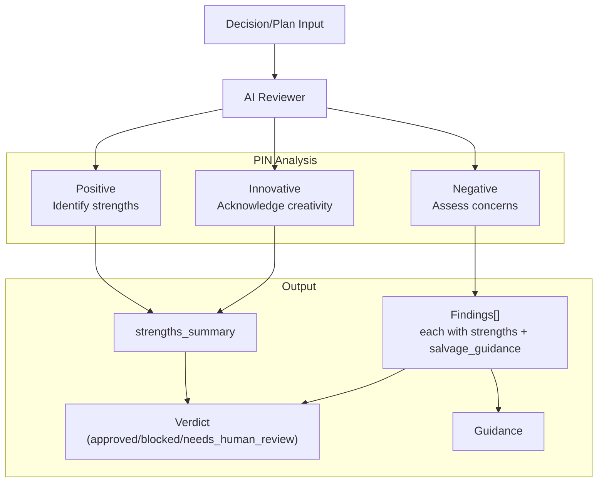

# PIN Review Methodology

## Type

pattern

## Description

All governance AI reviews follow the PIN (Positive, Innovative, Negative) methodology. Every review verdict includes `strengths_summary`, and every finding includes `strengths` and `salvage_guidance`. A blocked verdict does not mean "everything is wrong"; it means specific concerns need addressing while preserving identified strengths.

## Structure

## Key Properties

- Constructive by design: even blocked verdicts highlight what to preserve
- Standards verified: every approval lists which standards were checked
- Salvage guidance: every finding explains how to fix while keeping good parts
- Applied to: `submit_decision`, `submit_plan_for_review`, `submit_completion_review`
