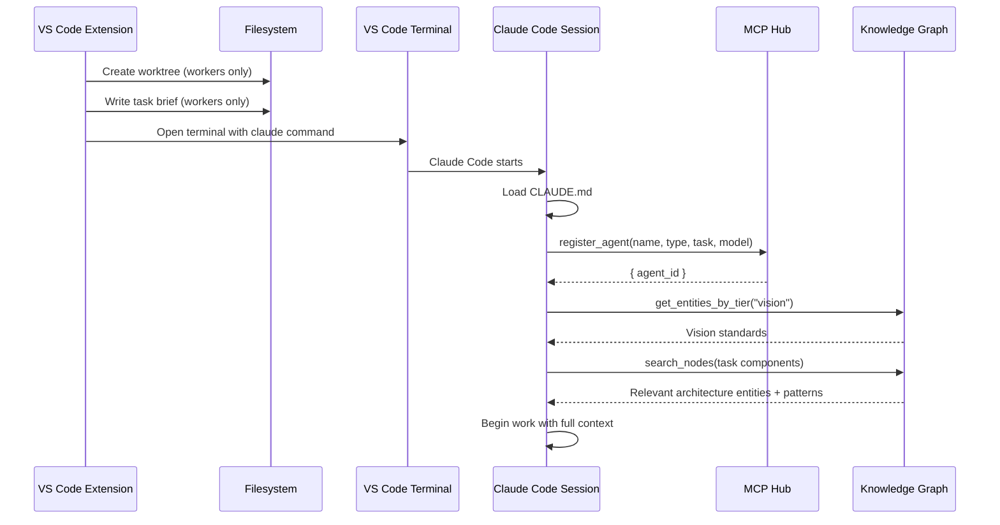
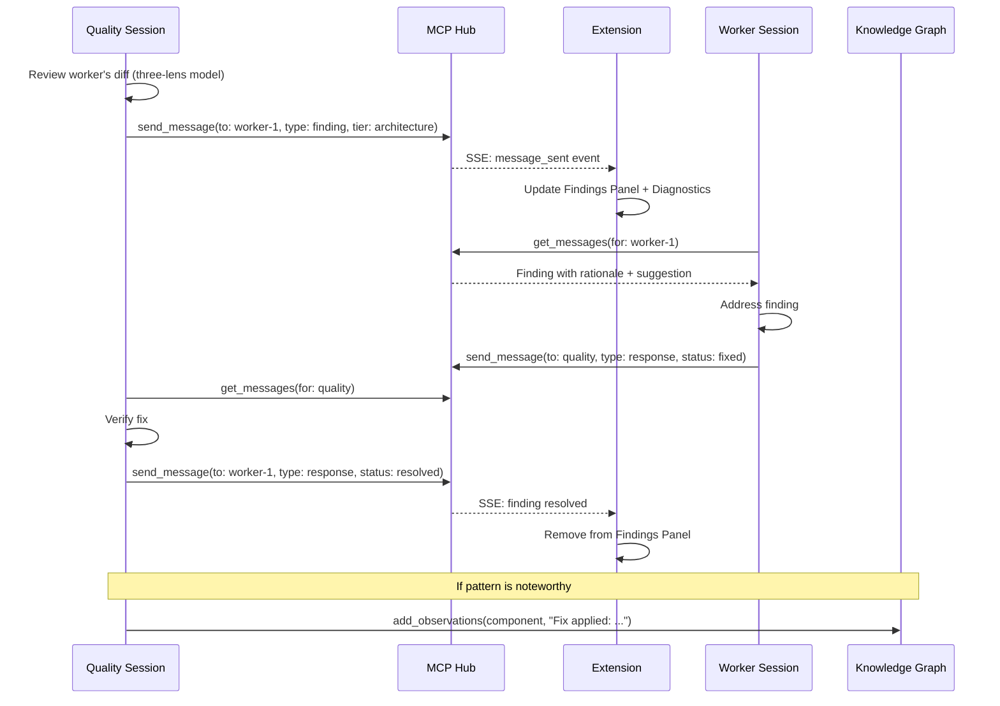
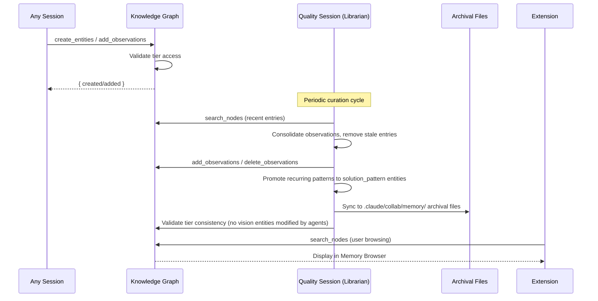
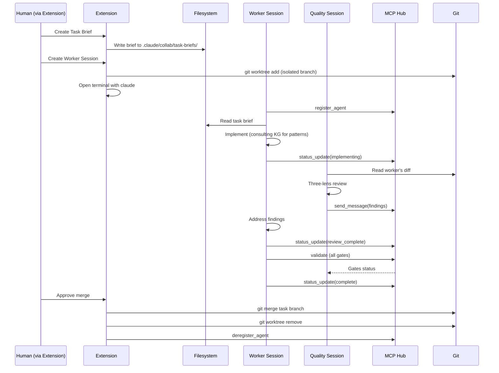
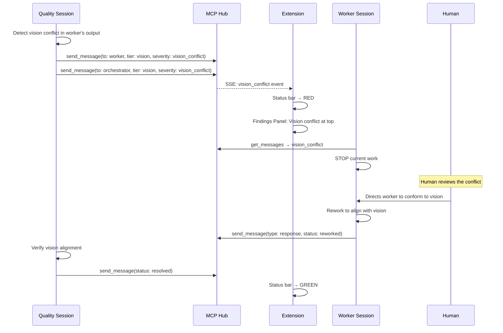

# Collaborative Intelligence System: Architecture Document

This document specifies the engineering-level architecture for the Collaborative Intelligence System. It translates the conceptual design in `COLLABORATIVE_INTELLIGENCE_VISION.md` into concrete component designs, interfaces, data flows, and build instructions.

**Relationship to the Vision Document**: The vision doc answers *why this system exists, what it's shaped like, and what principles govern it*. This document answers *how to build it*. Every architectural decision here traces back to a principle or capability defined in the vision doc. Where this document adds components not covered in the vision doc (notably the VS Code extension), those additions serve the vision's goals.

---

## Table of Contents

1. [System Boundaries and Glossary](#1-system-boundaries-and-glossary)
2. [System Component Diagram](#2-system-component-diagram)
3. [VS Code Extension Architecture](#3-vs-code-extension-architecture)
4. [MCP Server Architecture](#4-mcp-server-architecture)
5. [Agent Session Architecture](#5-agent-session-architecture)
6. [Data Flow Architecture](#6-data-flow-architecture)
7. [File System Layout](#7-file-system-layout)
8. [Technology Stack](#8-technology-stack)
9. [API Contracts](#9-api-contracts)
10. [Security Model](#10-security-model)
11. [Build, Test, and Development Setup](#11-build-test-and-development-setup)
12. [Implementation Phases](#12-implementation-phases)
13. [Verification](#13-verification)

---

## 1. System Boundaries and Glossary

### In Scope

- VS Code extension (orchestration UI)
- Three MCP servers: Communication Hub, Knowledge Graph, Quality
- Claude Code session management (Orchestrator, Worker, Quality session types)
- Inter-session communication protocol
- Tier-aware institutional memory
- File system conventions for task briefs, artifacts, and archival memory
- Installation into target projects

### Out of Scope

- The target project being developed (e.g., the codebase the agents work on)
- CI/CD pipelines for target projects
- External service internals (CodeRabbit, GitHub Actions)
- External orchestration frameworks (no Goose, LangGraph, AutoGen, CrewAI)
- API key management — Claude Code Max provides cloud-based model access via subscription (no API keys needed)

### Glossary

| Term | Definition |
|------|-----------|
| **Orchestrator** | The human developer working through a primary Claude Code session. The strategic decision-maker. |
| **Worker Session** | A Claude Code instance running in an isolated git worktree, implementing a specific task. |
| **Quality Session** | A persistent Claude Code instance specialized for vision enforcement, architecture protection, and quality automation. |
| **MCP Hub** | The Communication Hub MCP server — provides agent registry, messaging, and broadcast. |
| **Knowledge Graph (KG)** | The MCP server providing persistent institutional memory as entities, relations, and observations. |
| **Finding** | A structured message from the Quality Session identifying an issue, tagged with tier and severity. |
| **Tier** | One of three oversight levels: T1 Vision (immutable), T2 Architecture (human-gated), T3 Quality (automated). |
| **Protection Tier** | The mutability level of a Knowledge Graph entity: `vision` (human-only), `architecture` (human-approved), `quality` (automated). |
| **Task Brief** | A structured markdown document defining a worker's assignment: goals, acceptance criteria, constraints, scope. |
| **Checkpoint** | A known-good state: a git tag + session-state.md update, resumable after failures. |
| **Drift** | Deviation from session goals — time drift, loop drift, scope drift, or quality drift. |

---

## 2. System Component Diagram

### High-Level Architecture

```mermaid
graph TB
    subgraph "VS Code"
        EXT["VS Code Extension<br/>(Orchestration UI)"]
        CC_EXT["Claude Code Extension<br/>(AI Interaction)"]
    end

    subgraph "MCP Servers (Local Processes)"
        HUB["Communication Hub<br/>(HTTP/SSE)"]
        KG["Knowledge Graph<br/>(HTTP/SSE)"]
        QUAL["Quality Server<br/>(HTTP/SSE)"]
    end

    subgraph "Claude Code Sessions"
        ORCH["Orchestrator Session<br/>(Opus 4.5, Interactive)"]
        W1["Worker Session 1<br/>(Opus 4.5, Worktree)"]
        W2["Worker Session 2<br/>(Opus 4.5, Worktree)"]
        QS["Quality Session<br/>(Opus 4.5, Persistent)"]
    end

    subgraph "Persistent State"
        GIT["Git<br/>(Code State)"]
        FS["Filesystem<br/>(.claude/collab/)"]
    end

    EXT -->|"manages lifecycle"| HUB
    EXT -->|"manages lifecycle"| KG
    EXT -->|"manages lifecycle"| QUAL
    EXT -->|"reads state"| HUB
    EXT -->|"browses memory"| KG
    EXT -->|"opens terminals"| ORCH
    EXT -->|"opens terminals"| W1
    EXT -->|"opens terminals"| W2
    EXT -->|"opens terminals"| QS
    EXT -->|"watches files"| FS

    ORCH -->|"registers, messages"| HUB
    ORCH -->|"queries memory"| KG
    W1 -->|"registers, messages"| HUB
    W1 -->|"queries/writes memory"| KG
    W1 -->|"runs quality checks"| QUAL
    W2 -->|"registers, messages"| HUB
    W2 -->|"queries/writes memory"| KG
    W2 -->|"runs quality checks"| QUAL
    QS -->|"registers, messages"| HUB
    QS -->|"curates memory"| KG
    QS -->|"orchestrates checks"| QUAL

    W1 -->|"branches, commits"| GIT
    W2 -->|"branches, commits"| GIT
    ORCH -->|"merges, tags"| GIT
    QS -->|"reads diffs"| GIT

    ORCH -->|"writes briefs"| FS
    QS -->|"writes findings"| FS
```



### Component Interaction Matrix

| From \ To | Extension | Hub | KG | Quality | Sessions | Git | Filesystem |
|-----------|-----------|-----|-----|---------|----------|-----|-----------|
| **Extension** | — | Manage lifecycle, query state | Browse entities | Display results | Spawn terminals | — | Watch `.claude/collab/` |
| **Hub** | Push via SSE | — | — | — | Deliver messages | — | — |
| **KG** | — | — | — | — | Return queries | — | Persist JSONL |
| **Quality** | — | — | — | — | Return results | — | — |
| **Orchestrator** | — | Register, message | Query/write | — | — | Merge, tag | Write briefs |
| **Workers** | — | Register, message | Query/write | Run checks | — | Branch, commit | Read briefs |
| **Quality Session** | — | Register, message, broadcast | Curate (Librarian) | Orchestrate | — | Read diffs | Write findings |

### Deployment Topology

All components run on a single developer machine (macOS):

- **VS Code Extension**: Runs in the VS Code Extension Host process
- **MCP Servers**: Run as separate local processes (spawned by the extension), communicating via HTTP/SSE on localhost ports
- **Claude Code Sessions**: Run as separate terminal processes (each in its own VS Code terminal)
- **Git/Filesystem**: Local, standard filesystem access

MCP servers and persistent state are local. AI inference is cloud-based via Anthropic's Claude models through Claude Code Max (no API keys needed, internet connection required).

---

## 3. VS Code Extension Architecture

The vision document describes the system entirely in terms of CLI sessions and MCP servers. This section specifies the VS Code extension that provides the orchestration UI — the human's primary control plane for managing multi-agent development work.

### 3.1 Role and Boundaries

The extension works **alongside** the existing Claude Code VS Code extension. It does NOT replace Claude Code. The division:

| Concern | Collab Intelligence Extension | Claude Code Extension |
|---------|-------------------------------|----------------------|
| AI interaction (prompts, responses) | No | Yes |
| Agent lifecycle (start, stop, resume) | Yes | No |
| Visual status and dashboards | Yes | No |
| MCP server management | Yes | No |
| Finding display and triage | Yes | No |
| Memory browsing | Yes | No |
| Task brief authoring | Yes | No |
| Checkpoint management | Yes | No |
| Code editing, file operations | No | Yes (via Claude Code) |

### 3.2 Activation and Lifecycle

**Activation events**:
- Opening a workspace containing `.claude/collab/` directory
- Opening a workspace containing `collab-intelligence.json` config marker
- Manual activation via command palette: `Collab Intelligence: Start System`

**Startup sequence**:
1. Detect collaborative project markers in workspace
2. Read `.claude/collab/mcp-config.json` for server configurations
3. Start MCP servers as child processes (if not already running)
4. Connect to MCP servers as a client (HTTP/SSE)
5. Populate UI views from MCP state (agent registry, findings, memory)
6. Display status bar items

**Deactivation**:
- Graceful shutdown of MCP server child processes
- Deregister any tracked sessions from Hub
- Persist workspace state (session IDs, preferences)

### 3.3 UI Components

#### 3.3.1 Activity Bar View Container

A dedicated Activity Bar icon ("Collab Intelligence") opens a sidebar containing four TreeView panels and access to the dashboard webview.

#### 3.3.2 Agent Status Panel (TreeView)

Displays all registered agents from the MCP Hub's agent registry.

**Data source**: `list_agents()` via Hub MCP server, polled every 3 seconds or via SSE push.

**Tree structure**:
```
Agents
├── orchestrator (Opus 4.5) — active
│   └── Task: Managing session-2026-01-28
├── worker-1 (Opus 4.5) — implementing
│   └── Task: task-001-auth-fix
├── worker-2 (Sonnet 4.5) — implementing
│   └── Task: task-002-test-coverage
└── quality (Opus 4.5) — monitoring
    └── Task: Continuous review
```

**Each node shows**: Agent name, model, status (idle/working/blocked/drift-detected).

**Context menu actions**: Send Message, View Session Log, Terminate Session, Resume Session.

#### 3.3.3 Findings Panel (TreeView)

Active findings from the Quality Session, grouped by oversight tier.

**Data source**: `get_messages(type: "finding", status: "open")` via Hub MCP server.

**Tree structure**:
```
Findings
├── Vision (1) ⛔
│   └── [STOP] Tap-to-confirm violates hands-free design
│       Rationale: HANDS_FREE_FIRST_DESIGN.md requires voice alternatives
│       Suggestion: Add voice confirmation command
├── Architecture (2) ⚠️
│   ├── New service diverges from DI pattern
│   └── Ad-hoc retry logic duplicates NetworkService
└── Quality (3) ℹ️
    ├── SwiftLint: 2 violations (auto-fixable)
    ├── Test coverage: 72% (target: 80%)
    └── Unused import in AuthManager.swift
```

**Tier ordering**: Vision findings always appear first. Architecture second. Quality third. This mirrors the vision doc's three-lens model.

**Actions per finding**: Acknowledge, Dismiss (requires justification text), Escalate to Human.

**Diagnostics integration**: Each finding maps to a `vscode.Diagnostic` entry:
- Vision findings → `DiagnosticSeverity.Error` (red squiggly)
- Architecture findings → `DiagnosticSeverity.Warning` (yellow squiggly)
- Quality findings → `DiagnosticSeverity.Information` (blue squiggly)

Three diagnostic collections: `collab-vision`, `collab-architecture`, `collab-quality`.

#### 3.3.4 Tasks Panel (TreeView)

Task briefs from `.claude/collab/task-briefs/`.

**Data source**: FileSystemWatcher on `.claude/collab/task-briefs/` directory.

**Tree structure**:
```
Tasks
├── task-001-auth-fix — in_progress (worker-1)
├── task-002-test-coverage — in_progress (worker-2)
├── task-003-voice-nav — pending
└── task-004-perf-audit — complete ✓
```

**Actions**: Create New Task (opens template in editor), Assign to Worker, View Brief, Mark Complete.

#### 3.3.5 Memory Browser (TreeView)

Browsable view of Knowledge Graph entities, grouped by protection tier.

**Data source**: `get_entities_by_tier(tier)` and `search_nodes(query)` via KG MCP server.

**Tree structure**:
```
Memory
├── Vision Standards (immutable)
│   ├── hands_free_first_design
│   │   └── 5 observations, 3 relations
│   └── voice_primary_interaction
├── Architecture (human-approved)
│   ├── KBOralSessionView [component]
│   ├── ServiceRegistry [pattern]
│   ├── protocol_based_di_pattern [pattern]
│   └── ... (12 more)
└── Quality (automated)
    ├── STT_audio_drop_problem [problem]
    ├── circular_buffer_pattern [solution]
    └── ... (8 more)
```

**Click to expand**: Full observations and relations for any entity.

**Search**: Text input that calls `search_nodes()` for semantic matching.

**Tier enforcement in UI**: Vision-tier entities show no edit actions. Architecture-tier entities show "Propose Change" (creates a change_proposal message). Quality-tier entities show "Edit Observations".

#### 3.3.6 Session Dashboard (Webview Panel)

A rich React-based webview providing at-a-glance system status.

**Contents**:
- **Session State**: Current goals, acceptance criteria, phase, blockers (from `session-state.md`)
- **Checkpoint Timeline**: Visual timeline of checkpoints with git refs
- **Message Feed**: Real-time structured messages from the Hub (not free-text chat — typed messages with tier badges)
- **Quality Gates**: Pass/fail indicators for build, lint, tests, coverage, security
- **Agent Cards**: Status cards for each registered agent with activity indicators

**Opened via**: Command palette (`Collab Intelligence: View Dashboard`) or status bar click.

**Data sources**: Hub (messages, agents), KG (memory stats), Quality server (gate status), filesystem (session-state.md).

#### 3.3.7 Status Bar Items

| Position | Content | Behavior |
|----------|---------|----------|
| Left | `$(shield) Collab: Active` | Green/yellow/red based on system health. Click opens dashboard. |
| Center | `2 workers · 3 findings · Phase: implementation` | Summary counts. Click opens sidebar. |
| Right | `$(cpu) Opus 4.5` | Current orchestrator model. Informational. |

Health logic:
- **Green**: All servers running, no vision/architecture findings open
- **Yellow**: Architecture findings open, or a worker in drift-detected state
- **Red**: Vision conflict open, server down, or critical error

#### 3.3.8 Output Channels

Three dedicated output channels for structured logging:

- `Collab Intelligence: Hub` — Agent registrations, messages sent/received, broadcasts
- `Collab Intelligence: Quality` — Quality gate results, auto-fix events, trust decisions
- `Collab Intelligence: Memory` — Knowledge graph reads, writes, tier protection events

### 3.4 Communication Architecture

#### Extension to Claude Code Sessions

The extension does NOT communicate with Claude Code sessions directly via an API. Instead:

1. **Interactive sessions**: The extension opens a new VS Code terminal (`vscode.window.createTerminal`) with the appropriate `claude` command and flags. The human interacts with the session through that terminal. The extension observes session state indirectly via the MCP Hub (sessions register themselves on startup).

2. **Headless queries**: For quick programmatic queries, the extension spawns `claude -p "prompt" --output-format json` via `child_process.spawn`, capturing stdout for the structured response.

3. **Session tracking**: Session IDs are captured when sessions register with the Hub. The extension stores these in `workspaceState` for resume operations.

#### Extension to MCP Servers

The extension acts as an MCP client connecting to the same servers that Claude Code sessions use.

- **Transport**: HTTP/SSE for all three servers (required for multi-client support — the extension and multiple Claude Code sessions all connect concurrently).
- **Role**: Read-mostly. The extension queries state for display. Claude Code sessions are the write-mostly clients (registering agents, sending findings, writing memory).
- **SSE channel**: The extension subscribes to Hub SSE events for real-time updates (new agent registrations, new messages, status changes) rather than polling.

#### Extension to Filesystem

- `vscode.workspace.createFileSystemWatcher('**/.claude/collab/**')` watches for changes to task briefs, session state, and artifacts.
- File changes trigger TreeView refreshes (Tasks panel, session state in dashboard).

### 3.5 State Management

| Store | Contents | Lifecycle |
|-------|----------|-----------|
| `ExtensionContext.workspaceState` | Tracked session IDs, MCP server PIDs, user preferences, panel layout | Persists across VS Code restarts, per-workspace |
| `ExtensionContext.globalState` | Default MCP server configs, model routing preferences | Persists globally across all workspaces |
| MCP Servers (source of truth) | Live agent registry, messages, knowledge graph, quality state | Persists via server storage (SQLite, JSONL) |
| Filesystem | Task briefs, session state, archival memory | Persists via git |

The extension never treats its local cache as authoritative. All live state is fetched from MCP servers. Local state is only for UI performance (avoiding redundant fetches) and session management (tracking which terminals map to which sessions).

### 3.6 Extension Commands

| Command ID | Title | Description |
|------------|-------|-------------|
| `collab.startSystem` | Start Collab System | Start MCP servers, initialize UI |
| `collab.stopSystem` | Stop Collab System | Gracefully shutdown servers and sessions |
| `collab.createWorkerSession` | Create Worker Session | Create worktree + open terminal with Claude Code |
| `collab.createQualitySession` | Create Quality Session | Open terminal with quality-focused Claude Code session |
| `collab.createTaskBrief` | Create Task Brief | Open editor with task brief template |
| `collab.checkpoint` | Create Checkpoint | Git tag + session-state.md update |
| `collab.sendMessage` | Send Message | Send structured message to agent via Hub |
| `collab.searchMemory` | Search Memory | Open search panel for Knowledge Graph |
| `collab.viewDashboard` | View Dashboard | Open the session dashboard webview |
| `collab.validateAll` | Validate All | Run all quality gates via Quality server |

### 3.7 Extension Project Structure

```
extension/
├── src/
│   ├── extension.ts                     # Activation, deactivation, command registration
│   ├── commands/
│   │   ├── systemCommands.ts            # startSystem, stopSystem
│   │   ├── sessionCommands.ts           # createWorker, createQuality, checkpoint
│   │   ├── messageCommands.ts           # sendMessage, searchMemory
│   │   └── taskCommands.ts              # createTaskBrief
│   ├── providers/
│   │   ├── AgentStatusTreeProvider.ts   # Agent registry TreeView
│   │   ├── FindingsTreeProvider.ts      # Tier-grouped findings TreeView
│   │   ├── TasksTreeProvider.ts         # Task briefs TreeView
│   │   ├── MemoryTreeProvider.ts        # Knowledge Graph browser TreeView
│   │   └── DashboardWebviewProvider.ts  # Session dashboard webview
│   ├── services/
│   │   ├── McpClientService.ts          # MCP connection management
│   │   ├── SessionManagerService.ts     # Claude Code session lifecycle
│   │   ├── WorktreeService.ts           # Git worktree create/cleanup
│   │   ├── FileWatcherService.ts        # .claude/collab/ watchers
│   │   └── StatusBarService.ts          # Status bar management
│   ├── mcp/
│   │   ├── HubClient.ts                # Typed client for Hub server
│   │   ├── KnowledgeGraphClient.ts     # Typed client for KG server
│   │   ├── QualityClient.ts            # Typed client for Quality server
│   │   └── McpTransport.ts             # HTTP/SSE transport layer
│   ├── models/
│   │   ├── Agent.ts                     # Agent registry data model
│   │   ├── Finding.ts                   # Finding data model
│   │   ├── Message.ts                   # Hub message data model
│   │   ├── Task.ts                      # Task brief data model
│   │   └── Entity.ts                    # Knowledge Graph entity model
│   └── utils/
│       ├── config.ts                    # Extension configuration helpers
│       └── logger.ts                    # Output channel logging
├── webview-dashboard/
│   ├── src/
│   │   ├── App.tsx                      # Dashboard React app
│   │   ├── components/
│   │   │   ├── SessionTimeline.tsx      # Checkpoint timeline visualization
│   │   │   ├── MessageFeed.tsx          # Structured message feed
│   │   │   ├── QualityGates.tsx         # Pass/fail gate indicators
│   │   │   └── AgentCards.tsx           # Agent status cards
│   │   └── hooks/
│   │       └── useVsCodeApi.ts          # VS Code webview API bridge
│   ├── vite.config.ts
│   └── package.json
├── media/
│   ├── icons/                           # TreeView and Activity Bar icons
│   └── styles/                          # Webview CSS
├── package.json                         # Extension manifest
├── tsconfig.json
└── esbuild.config.js                    # Extension build config
```

---

## 4. MCP Server Architecture

All three MCP servers use HTTP/SSE transport. This is required because multiple clients (the VS Code extension and multiple Claude Code sessions) must connect to the same server instance simultaneously.

### 4.1 Communication Hub Server

**Purpose**: Agent registry, message routing, and broadcast. The primary real-time communication channel between all sessions. (Vision doc: Section 3, Channel A)

**Transport**: HTTP/SSE on `localhost:3100`

**Storage**: In-memory (primary) + SQLite (crash recovery). Messages persist for the duration of a collaborative session. SQLite provides recovery if the server process restarts.

#### Tool Interface

```
register_agent(
  name: string,           # "worker-1", "quality", "orchestrator"
  type: string,           # "orchestrator" | "worker" | "quality"
  task: string,           # Current task description
  worktree?: string,      # Worktree path (workers only)
  model: string,          # "opus-4-5" | "sonnet-4-5" | "haiku"
  capabilities?: string[] # ["implementation", "review", "research"]
) → { agent_id: string }

deregister_agent(
  agent_id: string
) → { success: boolean }

list_agents(
  type?: string,          # Filter by agent type
  status?: string         # Filter by status
) → Agent[]

send_message(
  to: string,             # Agent name or "all" for broadcast
  type: string,           # "finding" | "response" | "change_proposal" | "status_update" | "drift_alert"
  tier?: string,          # "vision" | "architecture" | "quality"
  severity?: string,      # "vision_conflict" | "security" | "architectural" | "logic" | "style" | "formatting"
  payload: object         # Type-specific structured payload
) → { message_id: string }

get_messages(
  for: string,            # Agent name
  status?: string,        # "unread" | "read" | "acknowledged"
  type?: string,          # Filter by message type
  since?: string          # ISO timestamp
) → Message[]

acknowledge_message(
  message_id: string
) → { success: boolean }

get_system_status() → {
  agents: { total: number, by_type: object },
  messages: { pending: number, total: number },
  uptime: number
}
```

#### Message Schema

Every message has a common envelope:

```typescript
interface Message {
  id: string;                    // UUID
  from: string;                  // Sender agent name
  to: string;                    // Recipient agent name or "all"
  type: MessageType;             // Discriminated union tag
  tier?: "vision" | "architecture" | "quality";
  severity?: Severity;
  timestamp: string;             // ISO 8601
  status: "sent" | "read" | "acknowledged";
  payload: FindingPayload | ResponsePayload | ChangeProposalPayload | StatusPayload | DriftPayload;
}
```

**Finding payload** (from Quality Session to Workers):
```typescript
interface FindingPayload {
  component: string;             // Affected component name
  finding: string;               // Description of the issue
  rationale: string;             // Project-specific explanation (not generic)
  suggestion?: string;           // How to fix, with code references
  standard_ref?: string;         // Reference to vision/architecture doc
}
```

**Change proposal payload** (from any agent to Orchestrator):
```typescript
interface ChangeProposalPayload {
  standard: string;              // Which standard to change
  current: string;               // Current standard definition
  proposed: string;              // Proposed new definition
  rationale: string;             // Why the change is needed
  impact: string;                // What would be affected
}
```

#### SSE Event Stream

The Hub exposes an SSE endpoint at `/events` that the extension subscribes to:

```
event: agent_registered
data: { "agent_id": "...", "name": "worker-1", "type": "worker" }

event: message_sent
data: { "message_id": "...", "from": "quality", "to": "worker-1", "type": "finding", "tier": "architecture" }

event: agent_status_changed
data: { "agent_id": "...", "status": "drift-detected" }
```

### 4.2 Knowledge Graph Server

**Purpose**: Persistent institutional memory with tier-aware protection. Stores entities (components, patterns, decisions, problems, vision standards), relations, and observations. All sessions share the same graph. (Vision doc: Section 5)

**Transport**: HTTP/SSE on `localhost:3101`

**Storage**: JSONL file (initial implementation, matching Anthropic's KG Memory server format). Migrate to SQLite + full-text search if query performance or semantic search demands it.

#### Tool Interface

```
create_entities(
  entities: [{
    name: string,
    entityType: string,          # "component" | "vision_standard" | "architectural_standard" | "pattern" | "problem" | "solution_pattern"
    observations: string[]       # Must include "protection_tier: <tier>" and "mutability: <level>"
  }]
) → { created: number }

create_relations(
  relations: [{
    from: string,                # Entity name
    to: string,                  # Entity name
    relationType: string         # "depends_on" | "follows_pattern" | "governed_by" | "fixed_by" | "exemplified_by" | "rejected_in_favor_of"
  }]
) → { created: number }

add_observations(
  entityName: string,
  observations: string[]
) → { added: number }
  # REJECTS if entity has protection_tier: vision and caller is not human
  # REJECTS if entity has protection_tier: architecture and change_approved flag is not set

delete_observations(
  entityName: string,
  observations: string[]
) → { deleted: number }
  # Same tier protection as add_observations

search_nodes(
  query: string                  # Search term (substring match or semantic)
) → Entity[]

get_entity(
  name: string
) → Entity                      # Full entity with observations and relations

get_entities_by_tier(
  tier: string                   # "vision" | "architecture" | "quality"
) → Entity[]

validate_tier_access(
  entityName: string,
  operation: string,             # "read" | "write" | "delete"
  callerRole: string             # "human" | "orchestrator" | "worker" | "quality"
) → { allowed: boolean, reason?: string }
```

#### Tier Protection Enforcement

The server enforces tier protection at the tool level, not by convention. This is critical — a misbehaving session cannot accidentally corrupt vision-tier data.

| Entity Tier | Read | Write (add observations) | Delete (observations) |
|-------------|------|--------------------------|----------------------|
| `vision` | All callers | Human only | Human only |
| `architecture` | All callers | Requires `change_approved: true` | Requires `change_approved: true` |
| `quality` | All callers | All callers | All callers |

The `callerRole` is determined by the `X-Agent-Role` HTTP header that each client includes in requests. The Hub server assigns roles at agent registration time.

### 4.3 Quality Server

**Purpose**: Wraps all quality tools (linters, formatters, test runners, coverage checkers) behind a unified MCP interface. Implements the Tool Trust Engine. Provides quality gate aggregation. (Vision doc: Section 6 — deterministic verification as the primary trust mechanism)

**Transport**: HTTP/SSE on `localhost:3102`

**Storage**: SQLite for Tool Trust Engine history and quality state.

#### Tool Interface

```
auto_format(
  files?: string[],              # Specific files, or all changed files if omitted
  language?: string              # "swift" | "python" | "rust" | "typescript"
) → { formatted: string[], unchanged: string[] }

run_lint(
  files?: string[],
  language?: string
) → { findings: LintFinding[], auto_fixable: number, total: number }

run_tests(
  scope?: string,                # "all" | "changed" | specific test path
  language?: string
) → { passed: number, failed: number, skipped: number, failures: TestFailure[] }

check_coverage(
  language?: string
) → { percentage: number, target: number, met: boolean, uncovered_files: string[] }

check_all_gates() → {
  build: { passed: boolean },
  lint: { passed: boolean, violations: number },
  tests: { passed: boolean, failures: number },
  coverage: { passed: boolean, percentage: number },
  findings: { passed: boolean, critical: number }
  all_passed: boolean
}

validate() → {                   # Comprehensive validation (all gates + summary)
  gates: GateResults,
  summary: string,
  all_passed: boolean
}

get_trust_decision(
  finding_id: string
) → { decision: "BLOCK" | "INVESTIGATE" | "TRACK", rationale: string }

record_dismissal(
  finding_id: string,
  justification: string,         # Required — no silent dismissals
  dismissed_by: string           # Agent or human identifier
) → { recorded: boolean }
```

#### Specialist Routing

The Quality Server routes checks to the best available tool per language:

| Language | Formatter | Linter | Test Runner |
|----------|-----------|--------|-------------|
| Swift | swiftformat | SwiftLint | xcodebuild test |
| Python | ruff format | ruff check | pytest |
| Rust | rustfmt | clippy | cargo test |
| TypeScript | prettier | eslint | vitest / jest |

The routing is configured in the Quality Server's config, not hardcoded. New languages/tools can be added by updating the config.

### 4.4 Server Lifecycle Management

**Startup**: The VS Code extension starts all three servers on `collab.startSystem`:

```typescript
// Pseudocode — extension startup
for (const server of ['hub', 'knowledge-graph', 'quality']) {
  const config = readMcpConfig(server);
  const process = spawn(config.command, config.args, { env: config.env });
  trackProcess(server, process);
  await waitForHealthCheck(`http://localhost:${config.port}/health`);
}
```

**Health monitoring**: The extension pings each server's `/health` endpoint every 10 seconds. If a server becomes unresponsive:
1. Status bar turns yellow/red
2. Extension attempts restart (up to 3 times)
3. If restart fails, notification to user with error details

**Configuration**: `.claude/collab/mcp-config.json`:

```json
{
  "servers": {
    "hub": {
      "command": "python",
      "args": ["-m", "collab_hub.server"],
      "port": 3100,
      "env": {}
    },
    "knowledge-graph": {
      "command": "python",
      "args": ["-m", "collab_kg.server"],
      "port": 3101,
      "env": {
        "KG_STORAGE_PATH": ".claude/collab/knowledge-graph.jsonl"
      }
    },
    "quality": {
      "command": "python",
      "args": ["-m", "collab_quality.server"],
      "port": 3102,
      "env": {}
    }
  }
}
```

**Claude Code session MCP config**: Sessions also need to connect to these servers. The extension generates a `.mcp.json` file that Claude Code reads:

```json
{
  "mcpServers": {
    "collab-hub": {
      "type": "http",
      "url": "http://localhost:3100/mcp"
    },
    "collab-kg": {
      "type": "http",
      "url": "http://localhost:3101/mcp"
    },
    "collab-quality": {
      "type": "http",
      "url": "http://localhost:3102/mcp"
    }
  }
}
```

---

## 5. Agent Session Architecture

### 5.1 Session Types

| Session | Model | Mode | CLAUDE.md | Purpose |
|---------|-------|------|-----------|---------|
| **Orchestrator** | Opus 4.5 | Interactive | `.claude/CLAUDE.md` | Human's primary session. Strategic decisions, delegation, checkpoint management. |
| **Worker** | Opus 4.5 (default) | Interactive (in worktree) | `.claude/worker-CLAUDE.md` | Implements specific tasks in isolated worktrees. |
| **Quality** | Opus 4.5 | Interactive (persistent) | `.claude/quality-session-CLAUDE.md` | Vision enforcement, architecture protection, quality automation, memory curation. |

Model downgrade to Sonnet 4.5 for workers is only appropriate when the orchestrator explicitly determines the task is routine and well-defined. The extension allows setting the model when creating a worker session.

### 5.2 CLAUDE.md Templates

Each session type has a tailored CLAUDE.md that instructs it on startup behavior, memory consultation, and communication protocols.

**Orchestrator CLAUDE.md** (key directives):
- Load session goals from `.claude/collab/session-state.md`
- Register with Hub as type `orchestrator`
- Query KG for vision standards governing current work area
- Delegate sustained work to worker sessions, not inline
- Create checkpoints after each meaningful unit of work
- Monitor Hub for drift alerts and vision conflicts

**Worker CLAUDE.md** (key directives):
- Read assigned task brief from `.claude/collab/task-briefs/`
- Register with Hub as type `worker`
- Before starting work: query KG for vision standards (`governed_by` relations), architectural patterns, and solution patterns relevant to the task's components
- Run quality checks via Quality MCP server before marking work complete
- Check Hub for messages from Quality Session after each significant change
- Respond to findings via Hub (acknowledge, explain, fix)
- Do not modify files outside the task brief's defined scope

**Quality Session CLAUDE.md** (key directives):
- Register with Hub as type `quality`
- At startup: load all vision-tier entities from KG
- Apply three-lens review model: vision first, architecture second, quality third
- Send findings via Hub with tier and severity tags
- Monitor workers for drift: time drift, loop drift, scope drift, quality drift
- Act as Librarian: curate KG entries, consolidate observations, promote patterns, remove stale data
- Sync important KG entries to archival files in `.claude/collab/memory/`
- Validate tier protection consistency in KG
- Proactively offer pattern guidance, not just reactive checking

### 5.3 Worktree Management

Worker sessions operate in isolated git worktrees to prevent interference:

**Creation** (triggered by `collab.createWorkerSession`):
```bash
git worktree add ../project-name-worker-1 -b task/001-auth-fix
```

**Convention**: Worktrees are created as siblings of the main repo directory, named `<project>-worker-<N>`.

**Cleanup** (after task completion and merge):
```bash
git merge task/001-auth-fix    # In main branch
git worktree remove ../project-name-worker-1
git branch -d task/001-auth-fix
```

The extension's `WorktreeService` manages creation, tracking, and cleanup.

### 5.4 Session Startup Protocol

When the extension creates a new session (via `collab.createWorkerSession` or `collab.createQualitySession`):



### 5.5 Session Lifecycle

```
Creation → Registration → Memory Consultation → Work → [Checkpoint]* → Review → Resolution → Completion → Deregistration → Cleanup
```

| Phase | Actor | Actions |
|-------|-------|---------|
| **Creation** | Extension | Create worktree, write brief, open terminal |
| **Registration** | Session | Register with Hub, set status to "active" |
| **Memory Consultation** | Session | Query KG for vision standards, architecture patterns, solution patterns |
| **Work** | Session | Implement task, periodically check Hub for messages |
| **Checkpoint** | Orchestrator | Git tag, update session-state.md |
| **Review** | Quality Session | Review diffs, send findings via Hub |
| **Resolution** | Worker + Quality | Iterative finding-fix-verify cycle |
| **Completion** | Worker | All gates pass, mark task complete in Hub |
| **Deregistration** | Session | Deregister from Hub |
| **Cleanup** | Extension | Merge branch, remove worktree, archive brief |

---

## 6. Data Flow Architecture

### 6.1 Finding Flow



### 6.2 Memory Flow



### 6.3 Task Flow



### 6.4 Vision Conflict Flow

When a vision conflict is detected, work stops immediately:



---

## 7. File System Layout

### Product Repository

```
agent-vision-team/                       # This repo — the standalone product
├── extension/                           # VS Code extension source
│   ├── src/                             # TypeScript source (see Section 3.7)
│   ├── webview-dashboard/               # React dashboard webview
│   ├── media/                           # Icons, styles
│   ├── package.json                     # Extension manifest
│   ├── tsconfig.json
│   └── esbuild.config.js
├── mcp-servers/
│   ├── hub/                             # Communication Hub MCP server
│   │   ├── collab_hub/
│   │   │   ├── __init__.py
│   │   │   ├── server.py                # FastMCP server definition
│   │   │   ├── registry.py              # Agent registry logic
│   │   │   ├── messaging.py             # Message routing logic
│   │   │   └── storage.py               # SQLite persistence
│   │   ├── tests/
│   │   ├── pyproject.toml
│   │   └── README.md
│   ├── knowledge-graph/                 # Knowledge Graph MCP server
│   │   ├── collab_kg/
│   │   │   ├── __init__.py
│   │   │   ├── server.py                # FastMCP server definition
│   │   │   ├── graph.py                 # Entity/relation/observation logic
│   │   │   ├── tier_protection.py       # Tier access enforcement
│   │   │   └── storage.py               # JSONL persistence
│   │   ├── tests/
│   │   ├── pyproject.toml
│   │   └── README.md
│   └── quality/                         # Quality MCP server
│       ├── collab_quality/
│       │   ├── __init__.py
│       │   ├── server.py                # FastMCP server definition
│       │   ├── tools/
│       │   │   ├── formatting.py        # auto_format tool
│       │   │   ├── linting.py           # run_lint tool
│       │   │   ├── testing.py           # run_tests tool
│       │   │   └── coverage.py          # check_coverage tool
│       │   ├── trust_engine.py          # Tool Trust Engine
│       │   ├── gates.py                 # Quality gate aggregation
│       │   └── storage.py               # SQLite persistence
│       ├── tests/
│       ├── pyproject.toml
│       └── README.md
├── templates/                           # Per-project installation templates
│   ├── claude-md/
│   │   ├── orchestrator-CLAUDE.md       # Orchestrator session template
│   │   ├── worker-CLAUDE.md             # Worker session template
│   │   └── quality-session-CLAUDE.md    # Quality session template
│   ├── collab/                          # .claude/collab/ directory template
│   │   ├── session-state.md
│   │   ├── task-briefs/
│   │   │   └── .gitkeep
│   │   ├── artifacts/
│   │   │   └── .gitkeep
│   │   ├── memory/
│   │   │   ├── architectural-decisions.md
│   │   │   ├── troubleshooting-log.md
│   │   │   └── solution-patterns.md
│   │   └── mcp-config.json
│   └── mcp.json                         # Default .mcp.json for Claude Code sessions
├── COLLABORATIVE_INTELLIGENCE_VISION.md # Vision document (T1, read-only)
├── ARCHITECTURE.md                      # This document
├── package.json                         # Root monorepo config
└── README.md
```

### Target Project (After Installation)

When the Collab Intelligence system is installed into a target project:

```
target-project/
├── .claude/
│   ├── collab/
│   │   ├── session-state.md             # Current session goals, checkpoints
│   │   ├── task-briefs/                 # Task assignments for workers
│   │   ├── artifacts/                   # Reports, reviews, research
│   │   ├── memory/                      # Archival memory files
│   │   │   ├── architectural-decisions.md
│   │   │   ├── troubleshooting-log.md
│   │   │   └── solution-patterns.md
│   │   ├── mcp-config.json              # MCP server port/path configuration
│   │   └── knowledge-graph.jsonl        # KG persistent storage
│   ├── CLAUDE.md                        # Orchestrator session config
│   ├── quality-session-CLAUDE.md        # Quality session config
│   └── worker-CLAUDE.md                 # Worker session config template
├── .mcp.json                            # Claude Code MCP server registration
├── .vscode/
│   └── settings.json                    # Extension activation settings
└── (project files...)
```

---

## 8. Technology Stack

| Component | Technology | Version | Rationale |
|-----------|-----------|---------|-----------|
| **VS Code Extension** | TypeScript | 5.x | Only option for VS Code extensions |
| **Extension Build** | esbuild | Latest | Fast bundling for extension code |
| **Dashboard Webview** | React + TypeScript + Tailwind CSS | React 19, Tailwind 4 | Rich reactive UI, widely known |
| **Webview Build** | Vite | Latest | Fast dev server + build for React |
| **MCP Servers** | Python + FastMCP | Python 3.12+, FastMCP latest | Consistent language across all servers; FastMCP simplifies MCP server creation |
| **KG Storage** | JSONL | — | Simple, portable, matches Anthropic's KG Memory format |
| **Hub/Quality Storage** | SQLite | — | Reliable, zero-config, sufficient for single-machine |
| **Claude Code** | CLI + VS Code extension | Latest | Claude Code Max subscription |
| **AI Models** | Opus 4.5 (default), Sonnet 4.5 (routine), Haiku (mechanical) | — | Per vision doc model routing table |
| **Version Control** | Git + worktrees | — | Code state coordination, worker isolation |
| **Package Management** | npm (extension), uv (Python servers) | — | Standard tooling per ecosystem |
| **OS** | macOS (Darwin) | — | Developer platform |
| **Runtime** | Node.js 18+ (extension), Python 3.12+ (servers) | — | Extension host + server processes |

---

## 9. API Contracts

### 9.1 MCP Server Tool Schemas

Full tool schemas are defined in Section 4 for each server. Key points:

- All tools use JSON-RPC 2.0 over HTTP
- Request/response types are defined as TypeScript interfaces (Section 4) and implemented as Python dataclasses in the servers
- Error responses follow MCP error conventions

### 9.2 Message Type Definitions

```typescript
// Discriminated union of all message types
type MessageType =
  | "finding"           // Quality → Worker: issue detected
  | "response"          // Worker → Quality: acknowledgment or fix status
  | "change_proposal"   // Any → Orchestrator: propose tier-2 standard change
  | "status_update"     // Any → Hub: agent status change
  | "drift_alert"       // Quality → Orchestrator + Worker: drift detected
  | "broadcast";        // Any → All: team-wide announcement

// Severity levels (ordered)
type Severity =
  | "vision_conflict"   // T1: Work stops. Must conform to vision.
  | "security"          // T2/T3: Immediate escalation to human.
  | "architectural"     // T2: Requires resolution before proceeding.
  | "logic"             // T3: Blocks task completion.
  | "style"             // T3: Note, no urgency.
  | "formatting";       // T3: Auto-fix silently.
```

### 9.3 Session Startup Protocol Contract

Every session MUST, in order:
1. Load its session-type-specific CLAUDE.md
2. Call `register_agent()` on the Hub
3. Call `get_entities_by_tier("vision")` on the KG
4. Call `search_nodes()` on the KG for entities relevant to the task's components
5. Check Hub for any existing messages (`get_messages()`)
6. Begin work

This protocol is encoded in the CLAUDE.md templates, not enforced programmatically.

### 9.4 Extension Command Contracts

All commands are registered in the extension's `package.json` `contributes.commands` and implemented in `src/commands/`. Parameters are collected via VS Code input UI (quick picks, input boxes) when needed.

---

## 10. Security Model

### 10.1 Trust Boundaries

```
Human Developer (full trust)
  └── VS Code Extension (developer's process permissions)
       ├── MCP Servers (developer's process permissions, local only)
       └── Claude Code Sessions (developer's process permissions)
            └── Subagents (within session's context, no MCP access for background subagents)
```

All components run as the developer's user. There is no privilege separation between components — security comes from architectural constraints, not OS-level isolation.

### 10.2 Tier-Based Access Control

Enforced at the Knowledge Graph server level (Section 4.2):

| Tier | Read | Write | Who Changes |
|------|------|-------|-------------|
| Vision | All | Human only | Human defines vision; agents enforce it |
| Architecture | All | Human-approved only | Agents propose changes; human approves |
| Quality | All | All | Automated, low-friction |

### 10.3 Worker Isolation

- Workers operate in separate git worktrees — file-level isolation from main branch
- CLAUDE.md scope constraints define what files workers may modify
- Workers cannot merge to main; only the orchestrator merges
- Workers cannot modify vision-tier KG entities (server-enforced)

### 10.4 Quality Session Constraints

- Read-focused: reviews code, does not write production code
- Can write to KG (Librarian role) and Hub (findings, alerts)
- Cannot merge branches or modify worktrees
- Cannot modify vision-tier entities

### 10.5 MCP Server Security

- All servers bind to `localhost` only — no network exposure
- No credentials stored in server code; use environment variables where needed
- Hub validates sender identity via registered agent ID
- No authentication between extension and servers (unnecessary for single-machine, single-user deployment)

### 10.6 Circuit Breakers

| Mechanism | What It Catches | Source |
|-----------|----------------|--------|
| Claude Code PreToolUse hooks | Dangerous file operations (mass deletion, etc.) | Claude Code built-in |
| Token budgets | Infinite loops, runaway sessions | Claude Code session limits |
| Quality Session drift monitoring | Time/loop/scope/quality drift | Quality Session via Hub |
| Git | Any code change is reversible | Standard git |
| Hub heartbeat timeout | Dead sessions still registered | Hub server logic |
| Extension health monitoring | Crashed MCP servers | Extension process monitoring |

---

## 11. Build, Test, and Development Setup

### 11.1 Prerequisites

- macOS (Darwin)
- Node.js 18+ and npm
- Python 3.12+ and uv (Python package manager)
- Git
- VS Code (latest stable)
- Claude Code CLI (installed via the Claude Code VS Code extension or standalone installer)
- Claude Code Max subscription (for Opus 4.5 access)

### 11.2 Repository Setup

```bash
# Clone the repo
git clone <repo-url> agent-vision-team
cd agent-vision-team

# Install extension dependencies
cd extension && npm install && cd ..

# Install MCP server dependencies
cd mcp-servers/hub && uv sync && cd ../..
cd mcp-servers/knowledge-graph && uv sync && cd ../..
cd mcp-servers/quality && uv sync && cd ../..
```

### 11.3 Extension Development

```bash
cd extension

# Watch mode (recompiles on change)
npm run watch

# Launch Extension Development Host
# Press F5 in VS Code (configured in .vscode/launch.json)

# Build webview dashboard
cd webview-dashboard && npm run build && cd ..

# Package as VSIX
npx vsce package
```

### 11.4 MCP Server Development

Each server can be developed and tested independently:

```bash
cd mcp-servers/hub

# Run the server
uv run python -m collab_hub.server

# Run tests
uv run pytest

# Test with MCP Inspector
npx @anthropic/mcp-inspector http://localhost:3100/mcp
```

### 11.5 Integration Testing

```bash
# 1. Start all MCP servers
cd mcp-servers/hub && uv run python -m collab_hub.server &
cd mcp-servers/knowledge-graph && uv run python -m collab_kg.server &
cd mcp-servers/quality && uv run python -m collab_quality.server &

# 2. Launch VS Code with extension in dev mode (F5)

# 3. Open a target project that has .claude/collab/ installed

# 4. Use extension commands to:
#    - Start system (should detect running servers)
#    - Create a worker session
#    - Verify agent appears in Agent Status panel
#    - Send a test finding from quality session
#    - Verify finding appears in Findings panel
```

### 11.6 End-to-End Smoke Test

1. Install the system into a test project (copy templates)
2. Start the Collab Intelligence system via extension command
3. Create a task brief
4. Launch a worker session
5. Worker implements the task
6. Quality session reviews and sends a finding
7. Worker addresses the finding
8. All quality gates pass
9. Merge and cleanup

---

## 12. Implementation Phases

The system is built in two parallel tracks that converge at defined integration points.

### Track A: MCP Infrastructure

| Step | Deliverable | Dependencies |
|------|-------------|-------------|
| **A1** | Communication Hub server — agent registry + messaging + SSE events | None |
| **A2** | Knowledge Graph server — entities, relations, observations, tier protection | None |
| **A3** | Quality server — tool wrapping, gates, trust engine | None |
| **A4** | Integration validation: two Claude Code sessions communicate via Hub, query KG | A1 + A2 |

A1, A2, and A3 can be developed in parallel.

### Track B: VS Code Extension

| Step | Deliverable | Dependencies |
|------|-------------|-------------|
| **B1** | Extension scaffold — activation, Activity Bar, empty TreeViews, status bar | None |
| **B2** | MCP client service — connect to Hub, KG, Quality servers | A1 (need a running Hub) |
| **B3** | Agent Status panel — live agent data from Hub | A1 + B2 |
| **B4** | Findings panel + Diagnostics — tier-grouped findings with in-editor squigglies | A1 + A3 + B2 |
| **B5** | Session management commands — create worker/quality sessions with worktrees | A1 + B2 |
| **B6** | Tasks panel — task brief CRUD, file watchers | B1 |
| **B7** | Memory Browser — KG entity browsing and search | A2 + B2 |
| **B8** | Dashboard webview — React-based session overview | A1 + A2 + A3 + B2 |

B1 and B6 can start immediately (no server dependencies). B2-B5, B7-B8 require servers from Track A.

### Track C: Session Templates and Installation

| Step | Deliverable | Dependencies |
|------|-------------|-------------|
| **C1** | CLAUDE.md templates for all three session types | A1 + A2 (need to reference MCP tools) |
| **C2** | `.claude/collab/` directory templates | None |
| **C3** | Installation script/command to set up a target project | C1 + C2 |

### Integration Milestones

| Milestone | Tracks Converging | What It Proves |
|-----------|-------------------|----------------|
| **M1: First Message** | A1 + B3 | Extension displays a live agent registered via MCP Hub |
| **M2: First Finding** | A1 + A3 + B4 | Quality finding appears in Extension's Findings panel with in-editor diagnostic |
| **M3: First Task Cycle** | A1 + A2 + A3 + B5 + C1 | Worker session completes a task, reviewed by Quality session, finding resolved, gates pass |
| **M4: Full System** | All tracks | Multi-worker session with dashboard, memory browsing, checkpoints, drift detection |

---

## 13. Verification

### 13.1 Component Verification

| Component | How to Verify |
|-----------|--------------|
| Hub server | Call all tools via MCP Inspector. Register two agents, send messages between them, verify delivery. Verify SSE events fire. |
| KG server | Create entities at each tier. Attempt to write to a vision-tier entity — verify rejection. Search nodes, verify results. |
| Quality server | Run `check_all_gates()` against a real codebase. Verify lint findings, test results, coverage numbers match direct tool output. |
| Extension TreeViews | Mock MCP responses, verify TreeView renders correct data. Test refresh on SSE events. |
| Extension commands | Create worker session — verify worktree created, terminal opened, agent registered in Hub. |
| Dashboard webview | Verify React components render with mock data. Test real-time message feed update. |

### 13.2 Integration Verification

| Scenario | Steps | Expected Outcome |
|----------|-------|-----------------|
| **Finding flow** | Quality session sends finding → Extension displays it → Worker acknowledges → Quality resolves | Finding appears in panel, disappears on resolution, diagnostics update |
| **Tier protection** | Worker session attempts `add_observations` on a vision-tier entity | KG server rejects the call with "tier_violation" error |
| **Drift detection** | Worker goes idle for extended period | Quality session sends drift_alert to Hub, Extension status bar turns yellow |
| **Checkpoint resume** | Create checkpoint, simulate failure, resume from checkpoint | Git state matches checkpoint, session-state.md reflects correct position |
| **Multi-worker coordination** | Two workers on related tasks, Quality session reviewing both | Findings routed to correct workers, no cross-contamination |

### 13.3 End-to-End Verification

The full system verification is a complete task cycle:

1. Human creates a task brief via Extension
2. Extension creates worktree and launches worker session
3. Worker registers with Hub, consults KG for patterns
4. Worker implements the task
5. Quality session reviews the diff, sends an architecture-tier finding
6. Finding appears in Extension's Findings panel with yellow squiggly in editor
7. Worker addresses the finding, responds via Hub
8. Quality session verifies the fix, resolves the finding
9. Worker runs `check_all_gates()` — all pass
10. Worker marks task complete
11. Human approves merge via Extension
12. Extension merges branch, cleans up worktree, archives brief
13. Quality session (Librarian) updates KG with any noteworthy patterns

Every step must succeed for the system to be considered functional.

---

*This architecture document specifies how to build the system described in `COLLABORATIVE_INTELLIGENCE_VISION.md`. The vision doc governs principles and priorities. This doc governs implementation. When in doubt, the vision doc's principles take precedence.*
